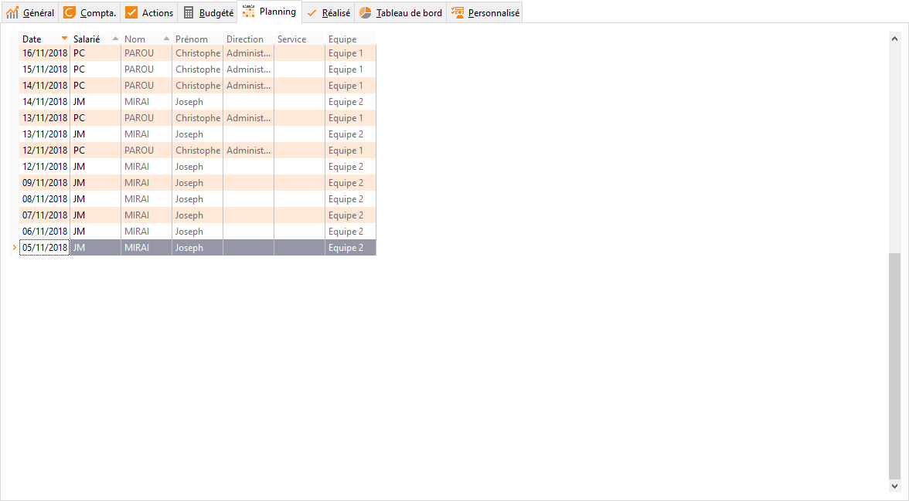

# Planning

Cet onglet permet de visualiser le planning d'intervention des salariés sur l'affaire.

 

La saisie peut-être ligne par ligne en saisissant la date et le salarié.

 

 

Pour un ensemble de lignes et  pour faciliter le travail de saisie, nous vous proposons un outil d’aide à la saisie à partir du menu contextuel choisissez "Ajouter un ensemble de lignes …".

 

 

Une fenêtre d’aide à la saisie vous permet alors de saisir les salariés soit :

* Par fourchette
* Par l’un des trois critères affectés

 

Puis de saisir la date de début de la mise en production ainsi que la durée (nombre de jours calendaires) prévue.

 

La grille affiche alors les jours pour les salariés concernés, avec une coche dans la colonne "Sélectionné" pour les jours ouvrables.

 

La coche ne sera pas activée pour les absences (le libellé indique le type et la date) ni pour les journées où le(s) salarié(s) sont affecté(s) à un autre chantier.

 

 

Vous pouvez alors forcer en journée de travail un jour d’absence en cochant la colonne "Sélectionné" du jour concerné. Par contre, une journée déjà affecté à un chantier (exemple le 01/10/2009 ne pourra pas être affecté au chantier comme travaillé.

 

Une fois les modifications effectuées, cliquez sur le bouton "OK" pour alimenter l’onglet "Planning" avec les éléments présents dans la grille.

 

Vous pouvez renouveler l’opération avec d’autres salariés, ou critères, ainsi que modifier un salarié sur une date.

 

 

Le menu contextuel vous permet également de revenir sur la fiche "Salarié" depuis cet onglet.

