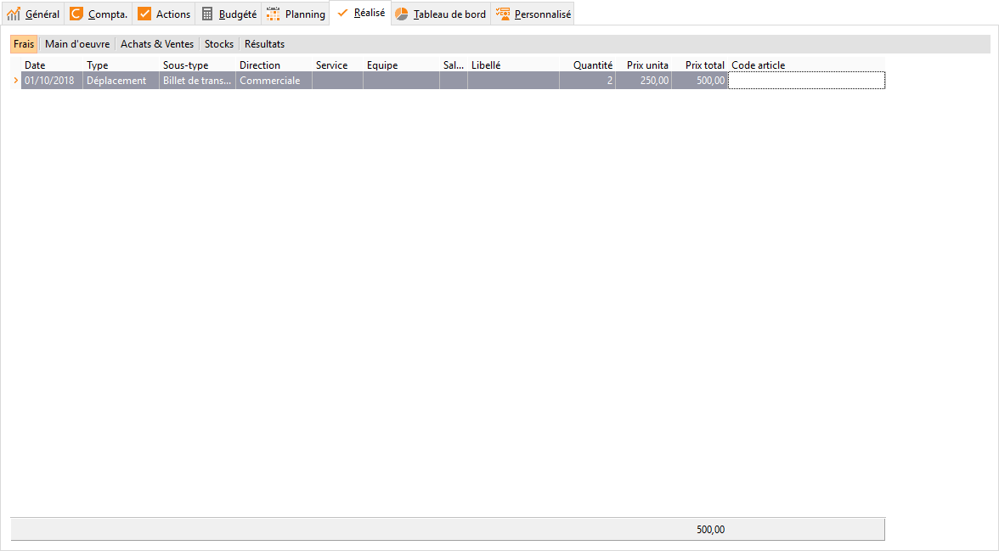

# Frais réalisés

Cet onglet permet de saisir le détail des frais supplémentaires supportés 
 mais non facturés directement par le fournisseur et/ou au client.

 

Ils peuvent concerner par exemple les frais d’ouverture de dossier, 
 les frais de papeterie …

 

 

Les données à renseigner sont :

* la date 
 d’exécution du frais
* le libellé 
 du frais
* le montant 
 représentant la charge de ce frais

