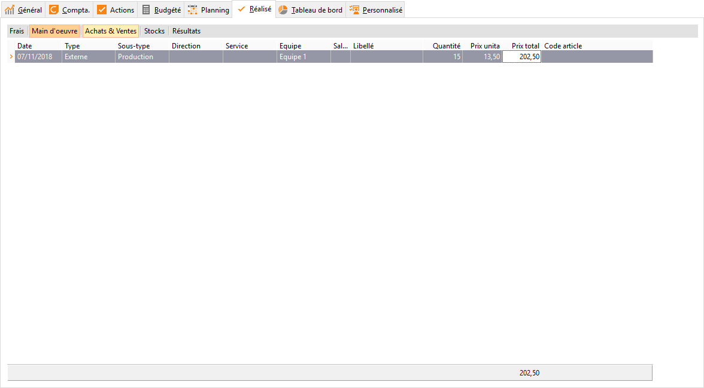

# Main d'oeuvre réalisée

Cet onglet permet de saisir les frais de main d’œuvre réalisés par différents salariés.

 

 

Les données à renseigner sont :

* La date de réalisation des frais de main d’œuvre
* La description de ce frais (libellé)
* Le code du salarié
* Le code de l'article de catégorie Main d'œuvre (type article : service)
* Le temps passé par le salarié pour une fabrication, le nombre d’articles Main d’œuvre

