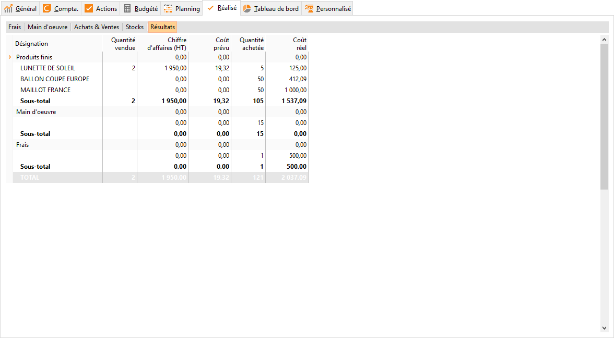

# Résultats réalisés

Cet onglet affiche le résultat de l’affaire, c’est à dire les frais 
 de main d’œuvre, les frais supplémentaires, les achats effectués pour 
 cette affaire, les ventes réalisées pour celle-ci ainsi que le coût prévu.

 

Seuls les documents à partir des bons de livraison et de réception sont 
 pris en compte dans ce tableau, ainsi que les documents de stock (exclut 
 des inventaires et écarts de stock).

 

Les colonnes de la grille de résultat représentent :

 

* les titres des catégories 
 d’article et la désignation des articles
* la quantité 
 d’article vendu/ Le chiffre d’affaires des articles vendus : Elle 
 est renseignée par les lignes des documents de ventes y compris les 
 lignes d’articles de catégorie Main d’œuvre, les frais en pied de 
 document de ventes et les lignes des documents de stock
* le coût 
 prévu des articles vendus : Elle est renseignée par le PUMP de l’article 
 à la réalisation de la pièce (Champ LIG\_COUT de la grille du document)
* la quantité 
 d’article acheté/ Le coût réel des articles achetés : Elle 
 est renseignée par les lignes des documents d’achats, les frais en 
 pied de document d’achats, les lignes des documents de stock, les 
 frais de l'onglet Frais et les frais concernant l'onglet Main d'œuvre

 

En ligne, vous avez :

 

* le détail de chaque catégorie d'article, (les frais de l'onglet 
 Main d'œuvre apparaissent dans la catégorie Main d’œuvre)
* le détail des frais de l'onglet 
 Frais de l’affaire
* le détail des frais saisis 
 en pied de documents d’achats ou de ventes
* le sous-total 
 de chaque détail
* le
total général de l’affaire pour 
 chaque colonne

 

Le menu contextuel de la grille de résultat vous permet :

 

* de recalculer le résultat 
 en fonction des différents documents réalisés depuis le dernier calcul
* d’exporter les données vers 
 Excel
* d’imprimer le résultat : différents 
 états sont à votre disposition
* de paramétrer les propriétés 
 des colonnes que vous souhaitez visualiser

 

 

