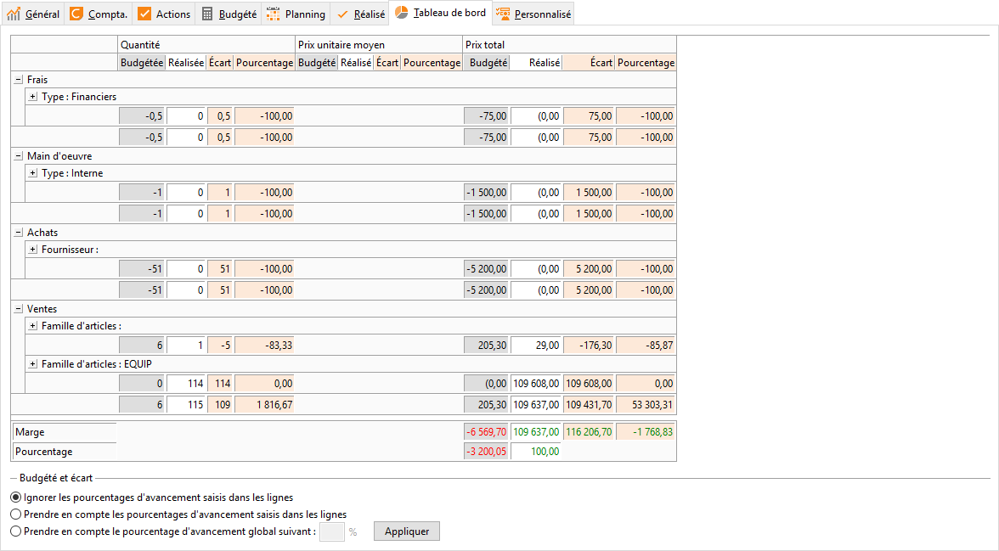
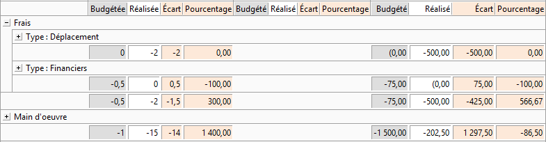
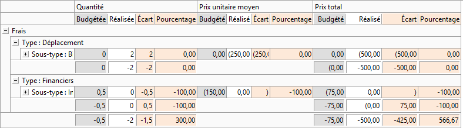
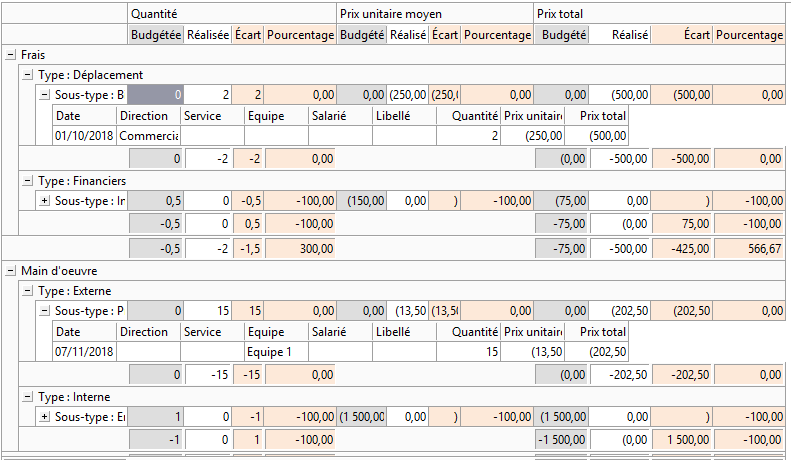
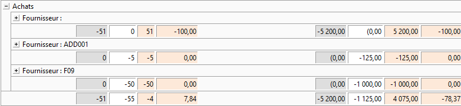
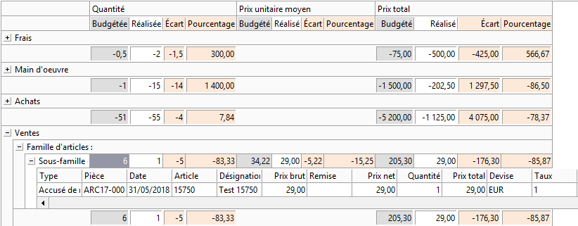
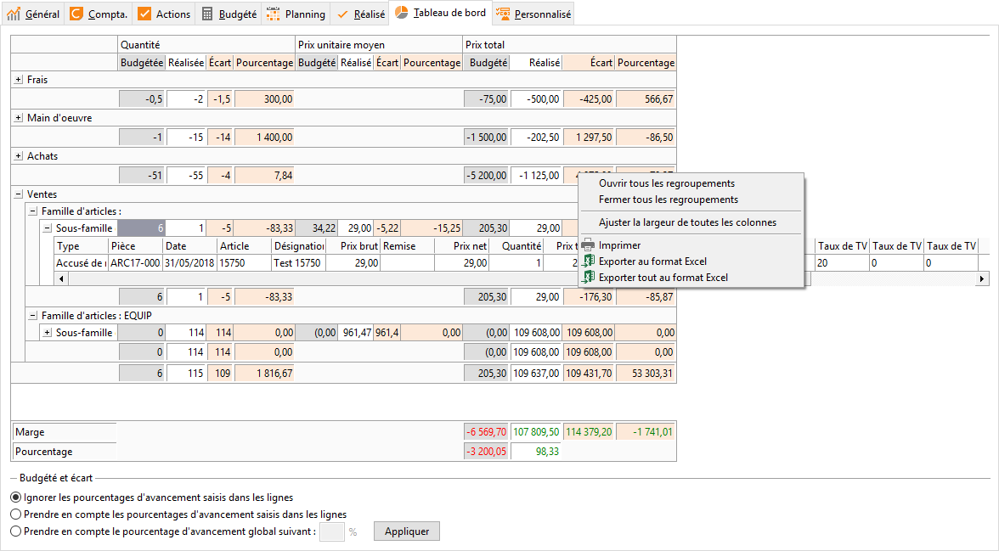
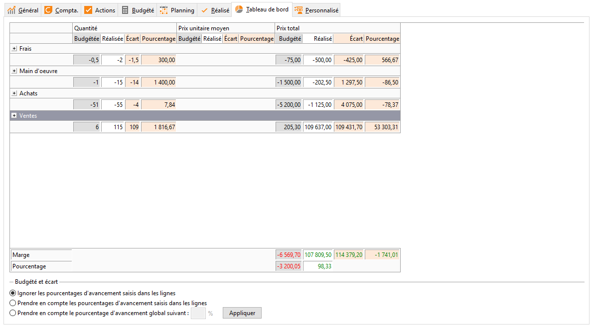
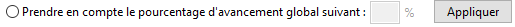

# Tableau de bord

La vue la plus synthétique reprend les quatre grands thèmes Frais / Main d’oeuvre / Achats / Ventes et les consommations de stock.

 

 

Un clic gauche sur la croix permet d’obtenir le détail du poste pour les frais et la main d’œuvre regroupé par Type et Sous-type.

 

 

On peut alors également détailler les valeurs prise en compte en cliquant sur la croix du sous-type ou en faisant un clic droit.

 

 

On obtient alors le détail des éléments pris en compte dans le réalisé avec possibilité de faire afficher une zone de regroupement.

 

Il suffit alors de sélectionner le titre des colonnes en déposant dans la zone de regroupement pour obtenir le regroupement souhaité.

 

  

Pour les achats, le déploiement permet d'avoir une présentation par fournisseur.

 

 

Pour les ventes, c'est une présentation par famille et sous famille d’articles

 

 

Dans les deux cas d’achat et de vente, il est possible d’afficher également une zone de regroupement dans le détail et sélectionner les critères de regroupement.

 

Le menu contextuel général permet la gestion de l’ouverture des regroupements et l’ajustement des colonnes ainsi que l’export et l’impression.

 

### Résultats

Le pied du tableau calcule la marge [(Frais + MO + Achats + Stock) – Ventes] ainsi que le pourcentage de marge.

 

Concernant les écarts, ils sont calculés au prorata du budget en fonction de l’option choisie concernant l’avancement :

 

 

* Ignorer les pourcentages d'avancement saisis dans les lignes : Écart sur budget total,
* Prendre en compte les pourcentages d'avancement saisis dans les lignes : Il calcule et affiche un prorata du budget par rapport au pourcentage d’avancement saisi dans la colonne "Pourcentage d’avancement" de l’onglet budget.

 

 

 

 

* Prendre en compte le pourcentage d'avancement global suivant  : Calcul tous les postes budget au prorata du pourcentage saisi dans la zone à côté.

 

 

 

 

