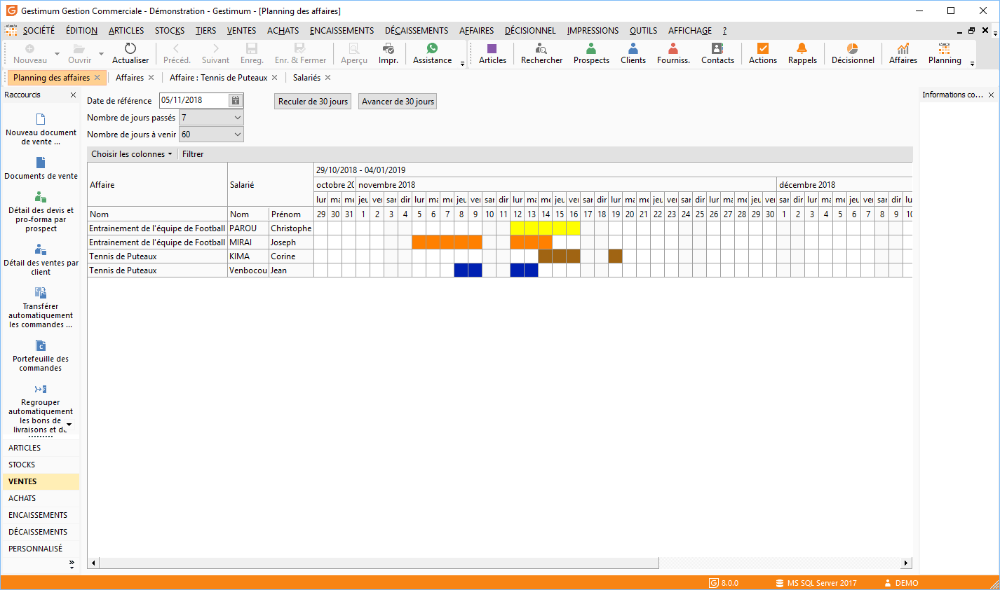
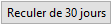
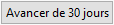
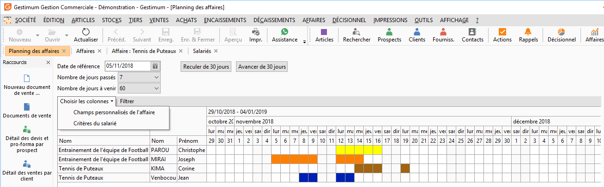
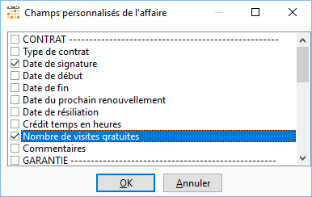
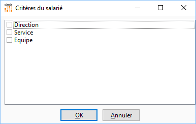
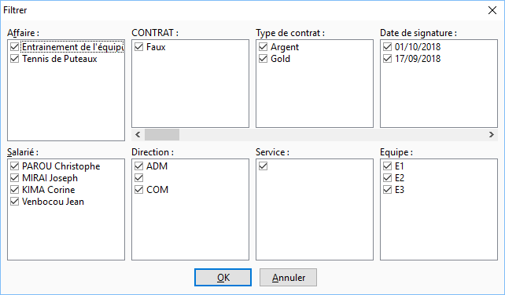
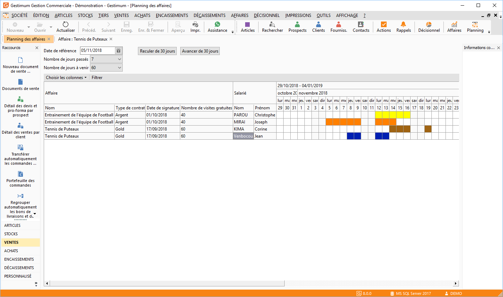
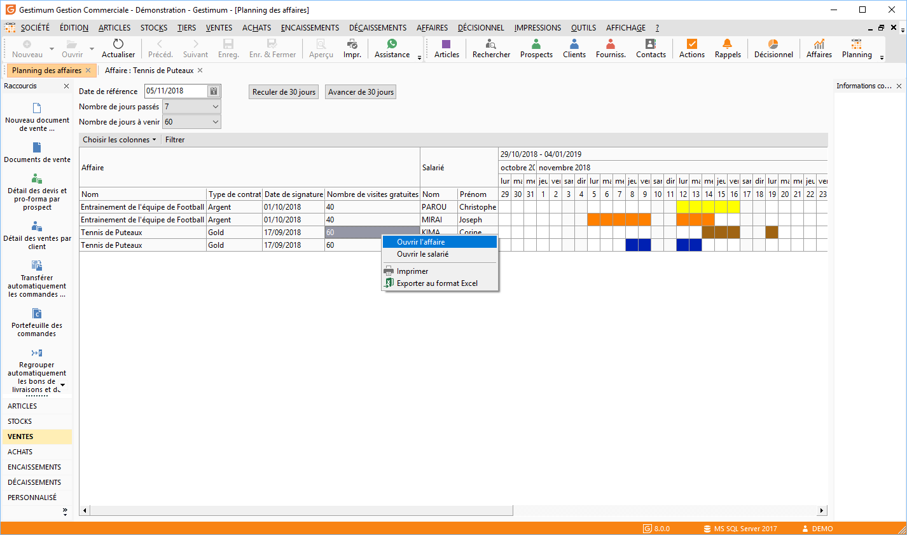
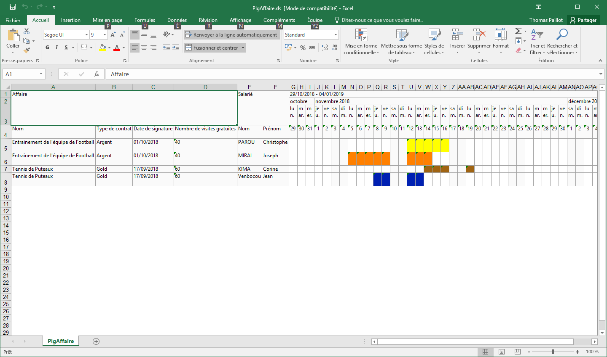

# Planning des affaires

A partir du menu Affaires/Planning des affaires ou depuis la liste des Affaires dans le menu contextuel "Planning".

## Affaires affichées

Le planning affichera toutes les affaires en cours dans la période sélectionnée. La période d’affichage est calculée par rapport à la date de référence (initialisée à la date du jour) moins le nombre de jours sélectionné dans l’option "Nombre de jours passés à afficher" plus le nombre de jours sélectionnés dans l’option "nombre de jours à venir à afficher".

 

 

Vous pouvez vous déplacer dans cette période à l’aide de l’ascenseur, ou:

* Reculer la période de 30 jours, en cliquant sur le bouton : 
* Avancer la période de 30 jours, en cliquant sur le bouton : 

## Choix des colonnes

Vous pouvez décider d’afficher dans le tableau les champs utilisateurs des affaires et les critères des fiches salariés. Pour cela, il vous suffit de cliquer sur le titre "Choisir les colonnes".

 

Il ne reste plus qu’à choisir la rubrique et cocher les champs ou les critères que vous souhaitez visualiser dans le planning.

 

ou 

## Filtre du planning

Vous pouvez également décider de filtrer les affaires qui s’affichent dans le planning par rapport aux éléments suivants Affaire / Champs utilisateurs / Salariés / Critères salariés.

 

Cliquer sur le titre "Filtrer" pour faire apparaître une fenêtre de filtre contenant ces éléments.

 

 

Dans chaque cadre d’affichage, apparaît les valeurs des éléments présents dans le planning. Il suffit de décocher les valeurs que vous ne souhaitez pas faire apparaître.

 

L’affichage du planning ne tient alors plus compte des journées des salariés affectés à l’équipe 3.

 

## Autres fonctions du planning

### Accéder à la fiche affaire

Vous pouvez à l’aide du menu contextuel ouvrir la fiche affaire sur laquelle le curseur est positionné.

### Accéder à la fiche salarié

Vous pouvez à l’aide du menu contextuel ouvrir la fiche du salarié sur lequel le curseur est positionné.

### Impression du planning

A l’aide du menu contextuel, vous pouvez imprimer le planning. L’impression passe par un aperçu vous permettant de configurer votre impression (Format, Style, entête et pied de page, etc.). Nous vous conseillons d’utiliser une imprimante au format A3. Vous pourrez enregistrer votre configuration.

## Export Excel

A l’aide du menu contextuel vous pouvez exporter au format Excel votre planning. Il vous sera proposé d’enregistrer le fichier (par défaut dans le répertoire temporaire GESTIMUM).

 

