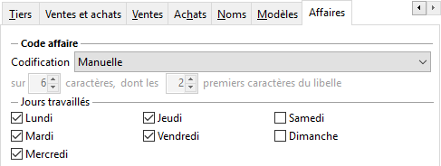
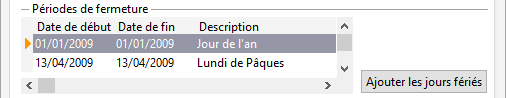
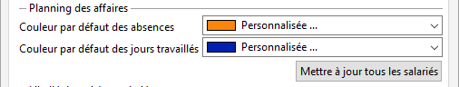
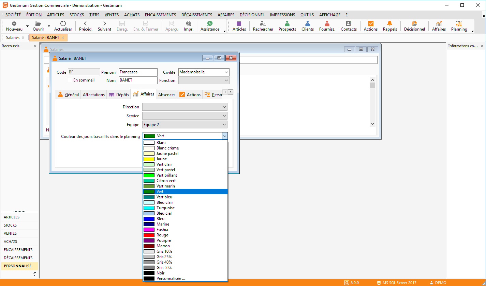
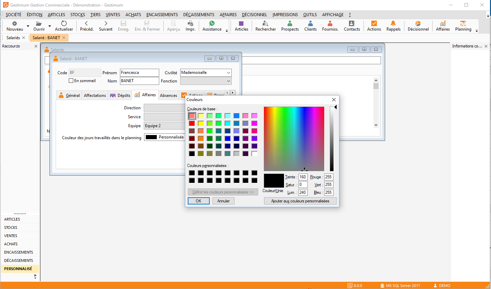
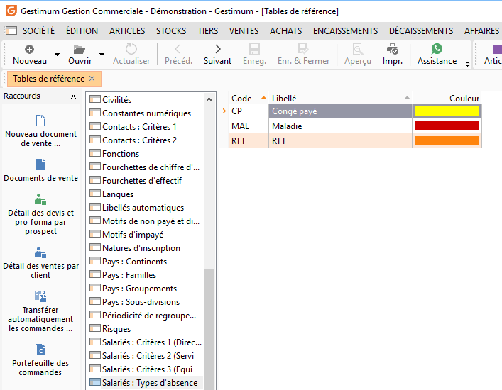
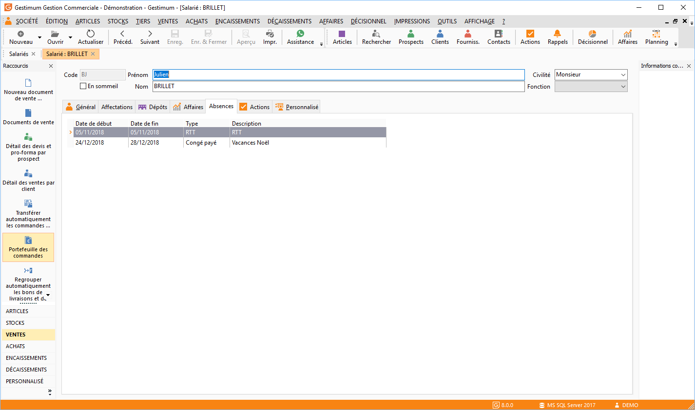

# Paramétrage du planning des affaires

## Jours travaillés et périodes de fermeture de la société

Il faut définir les jours travaillés dans l’entreprise ainsi que les périodes de fermeture (congés ou jours fériés).

A partir du menu SOCIÉTÉ | Paramétrage | Préférences de gestion, onglet "Affaires".

## Jours travaillés

Il faut cocher les jours de la semaine travaillés au sein de l’entreprise (Il sera possible lors de la planification de forcer un jour défini comme non travaillé en journée de travail).

 

## Périodes de fermeture

Vous pouvez saisir les jours (par période) de fermeture de la société (exemple: les congés d’été si la société ferme complètement), les jours fériés. Pour la France, vous pouvez les insérer automatiquement en cliquant sur le bouton Ajouter les jours fériés (Vous pourrez alors choisir l’année, pour laquelle les jours doivent être insérés).

 

## Couleurs d’affichage dans le planning

### Couleurs par défaut

Vous pouvez définir deux couleurs d’affichage par défaut pour les absences et les jours travaillés. Ces deux couleurs seront alors reprisent par défaut lors de la création des types d’absence et des salariés. Elles seront alors modifiables.

 

A partir du menu Société/Paramétrage/Préférences de gestion, onglet "Affaires".

 

 

Vous pourrez mettre à jour (avec la valeur de la couleur par défaut des jours travaillés la liste de vos salariés en cliquant sur le bouton: "Mettre à jour tous les salariés".

### Couleur d’affichage des salariés

Vous pouvez distinguer la couleur qui sera utilisée pour afficher dans le planning, les journées de travail pour chaque salarié. (Par défaut, la couleur défini dans les préférences sera utilisée pour tous les salariés).

A partir du Menu Société/Salariés onglet "Affaires".

 

Vous pouvez soit choisir dans la liste qui vous est proposée,

 

 

Soit personnaliser vos couleurs en choisissant "personnalisée" à la fin de la liste.

 

### Types d’absences

Vous pouvez si vous le souhaitez définir différents types d’absence et leur affecter des couleurs différentes qui seront alors utilisées lors de l’affichage du planning. Il suffit de cliquer dans la cellule "Couleur", puis sur les****apparaissant à côté de la valeur de couleur.

 

A partir du menu SOCIÉTÉ | Paramétrage | Tables de référence : "Salariés : Type d’absence".

 

### Absences des salariés

A partir du menu SOCIÉTÉ | Salariés et de l'onglet  "Absence".

 

Vous pouvez saisir dans cet onglet les jours ou la période d’absence de vos salariés, cela permettra lors de la planification des salariés sur les affaires, de contrôler leur disponibilité.

 

