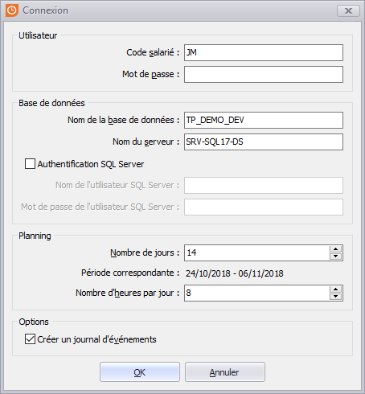

# Connexion

Lors de l'ouverture du logiciel, il faut remplir différents éléments pour se connecter à la base de données.

On commence par renseigner le code salarié et le mot de passe stocké dans la fiche salarié. Ce dernier doit être obligatoirement dans un champ personnalisé avec le MDP (XXX\_MDP) et le libellé "Mot de passe".

Ensuite, on note la base de données et le nom de du serveur SQL avec la méthode d'authentification.

Enfin, on peut saisir le nombre de jour à afficher dans le planning et le nombre d'heure travaillé par jour.

L'option "Créer un journal d'événements" permet de tracer toutes les requêtes qui sont faites au serveur SQL lors de la saisie des temps.

