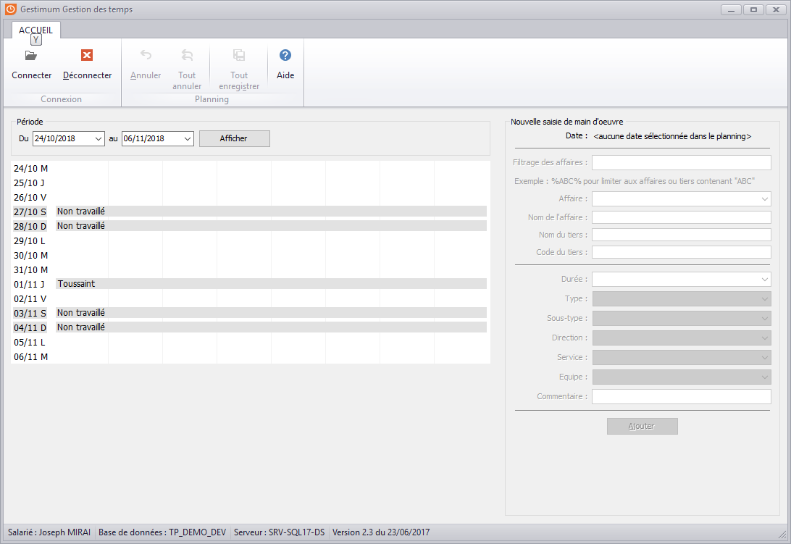
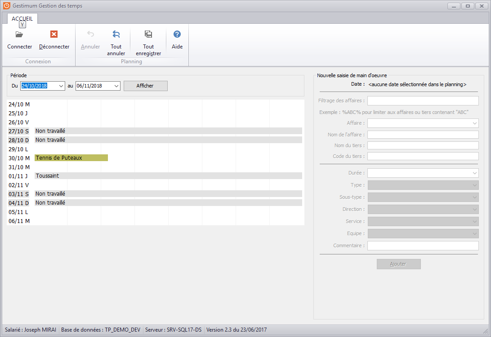
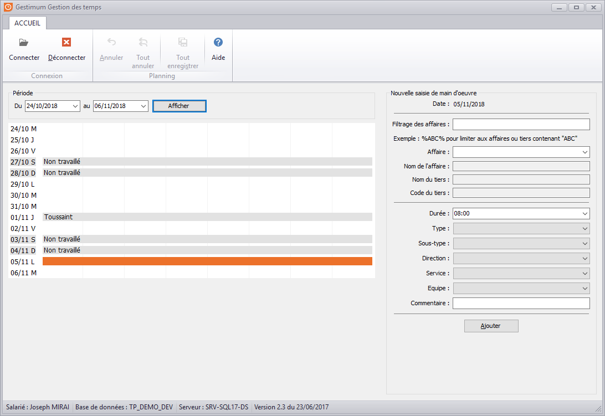
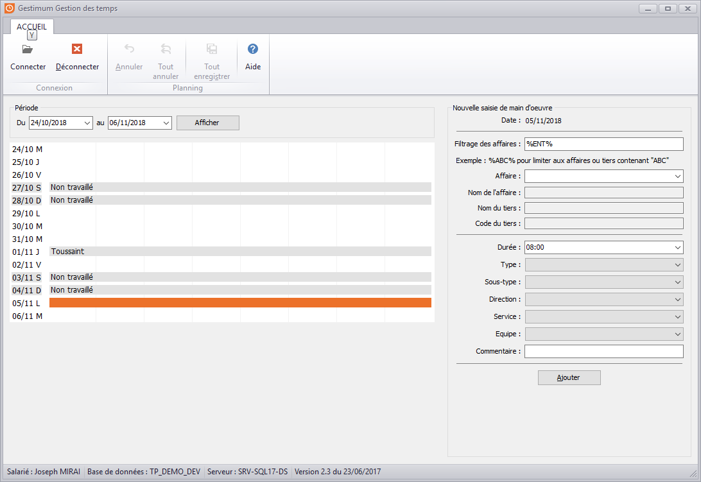
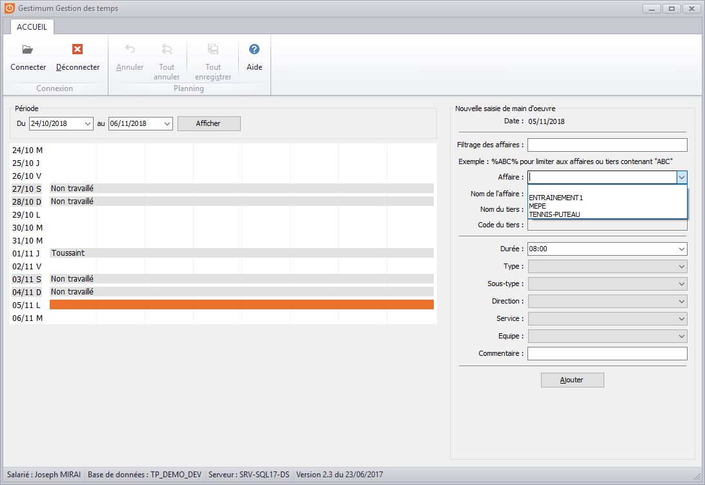
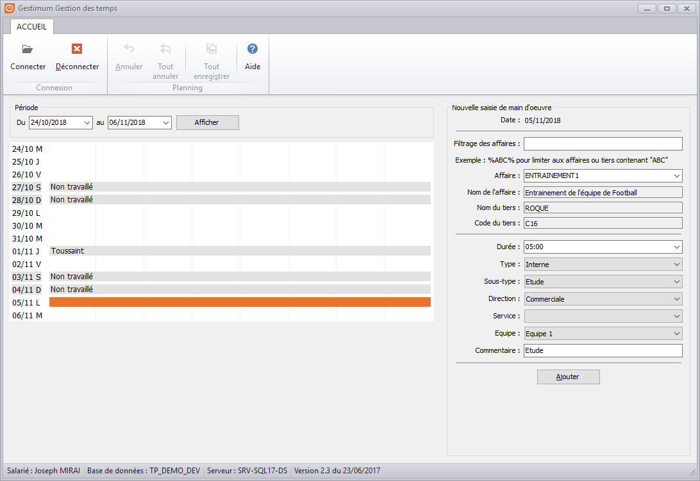
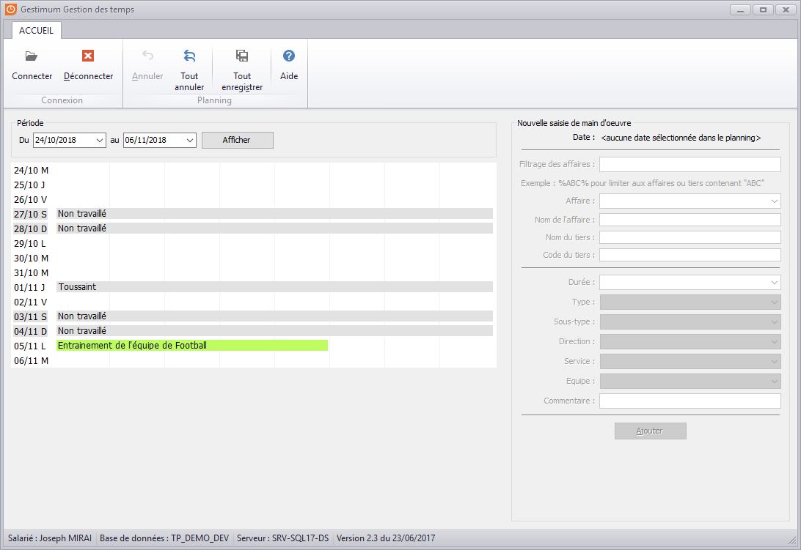

# Utilisation

Après la connexion, on arrive sur cette page avec un filtre de période et un planning sur la partie de gauche et des zones de saisi sur la partie de droite :

Le planning peut aussi afficher des données déjà saisies.

Il faut commencer par sélectionner le jour de l'intervention, alors la partie de droite s'initialise.

Ensuite, on peut soit filtrer sur l'affaire pour laquelle on a travaillé soit aller rechercher une affaire dans le menu déroulant

Une fois l'affaire sélectionnée, on peut venir renseigner la durée de travail ainsi que le type et sous-type de main d'oeuvre et les critères provenant de la fiche salarié.

Une fois que l'on saisit toutes les informations voulues, il faut cliquer sur "Ajouter". Une ligne apparaît alors dans le planning.

Pour valider la saisi dans le planning et envoyer les infos dans Gestimum ERP, on clique sur le bouton "Tout enregistrer" ou le raccourci Alt + S.

