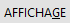

# Menu AFFICHAGE

Le menu Affichage permet à l'utilisateur de modifier et de personnaliser 
 les différentes barres présentes (indiquées par une coche devant) ou non 
 à l'écran lors du lancement du logiciel.

## Accès au menu affichage

Il existe différentes méthodes pour accéder au menu Affichage

* Raccourci clavier 
 Alt+A
* Barre de Menu 

