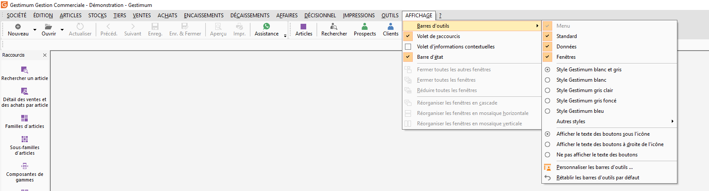
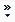
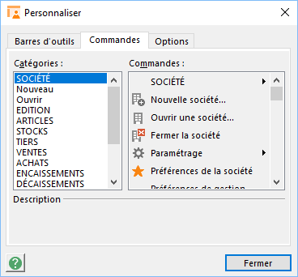
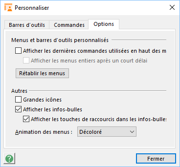

# Barre d'outils

Les icônes de la barre d'outils ont des actions génériques dont le résultat dépend de la fenêtre courante.

## Description des menus et des barres d'outils

Une barre d'outils peut contenir deux types de boutons, "liste de choix" ou "simple action". Les barres s'affichent ou se masquent à volonté. Par défaut, les barres d'outils "Standard" et "Données" sont ancrées côte à côte en dessous de la barre de menus, mais peuvent être rendues flottantes (détachées de l'emplacement par défaut) au choix de l'utilisateur.

 

## Utilisation des menus et des barres d'outils

Éléments affichés sur les menus et les barres d'outils. Lorsque vous démarrez Gestimum pour la première fois, les menus et les barres d'outils affichent les commandes et les boutons de base.

### Recherche de commandes de menu

Pour rechercher une commande de menu qui ne s'affiche pas, cliquez sur les flèches  en bas du menu. Le menu se développe pour afficher des commandes supplémentaires.

Vous pouvez également développer le menu en double-cliquant dessus. Lorsque vous développez un menu, tous les autres menus sont développés tant que vous ne sélectionnez pas une commande ou réalisez une autre action. Toute commande sur laquelle vous cliquez dans le menu développé est immédiatement ajoutée à la version personnalisée (réduite) du menu. Si vous n'utilisez plus cette commande pendant quelque temps, Gestimum ne l'affiche plus dans la version réduite du menu. Si vous le souhaitez, vous pouvez indiquer à Gestimum de toujours afficher l'ensemble des commandes pour chacun menu.

### Recherche de boutons de barre d'outils

Lorsque plusieurs barres d'outils sont ancrées sur la même ligne, elles affichent uniquement les boutons que vous avez utilisés le plus récemment. Pour rechercher un bouton qui ne s'affiche pas sur une barre d'outils ancrée cliquez sur Autres boutons  à la fin de la barre d'outils.

 

Lorsque vous utilisez un bouton qui n'est pas affiché sur la barre d'outils, Gestimum déplace ce bouton sur la barre d'outils à la place d'un bouton qui n'a pas été utilisé depuis longtemps et relègue ce dernier dans la liste Autres boutons .

 

Vous pouvez également redimensionner une barre d’outils pour afficher davantage de boutons ou vous pouvez afficher tous les boutons d'une barre d'outils.

## Personnalisation des menus et des barres d'outils

Vous pouvez personnaliser menus et barres d'outils en ajoutant ou supprimant des commandes.

 

Vous ne pouvez pas masquer la barre de menus (grisée).

 

Vous pouvez également créer vos propres barres d’outils en ajoutant, réorganisant et supprimant des boutons et des menus.

### Utilisation de la barre d'outils Personnaliser

Pour modifier / créer vos menus et barres d'outils, ouvrir la boîte de dialogue Personnaliser (menu AFFICHAGE/Barre d’outils/Personnaliser les barres d'outils).

 

Annulation des modifications. Vos paramètres personnels sont sauvegardées dans les fichiers GestimumGestion.Barres et/ou GestimumCompta.Barres (répertoire d'installation de Gestimum). La suppression de ses fichiers annulera toutes vos modifications.

### Bascule entre les menus personnalisés et les menus complets

Dans le menu AFFICHAGE/Barre d’outils/Personnaliser les barres d'outils/Onglet Options

 

 

Procédez de l'une des manières suivantes :

* Pour afficher uniquement les commandes de base et les commandes fréquemment utilisées, activez la case à cocher "Afficher les dernières commandes utilisées en haut des menus".
* Pour que le menu affiche l'ensemble des commandes de menu après un bref délai lorsque vous laissez reposer le pointeur sur un menu ouvert, activez la case à cocher "Afficher les menus entiers après un court délai",
* Pour afficher l'ensemble des commandes dans les menus, décochez ces mêmes cases.

 

Remarque : Le bouton Rétablir les menus réinitialise vos barres d'outils et les commandes de menus (non pas sur leur forme d'origine, mais selon le dernier paramétrage de l'onglet Personnaliser.

## Gestion des données

La gestion (création, ouverture/modification, enregistrement, impression) des documents et des fiches de travail (articles, clients, fournisseurs, comptes, guides, …), le déplacement dans les listes ou de fiche en fiche, l’ouverture de la liste (en mode Fiche) s'effectuent avec la barre d’outils.

 

Il existe toutefois des équivalents claviers et dans certains cas, le menu contextuel peut être utilisé.

 

Si aucune fenêtre n'est active, le logiciel traite automatiquement les documents de ventes, d'achats ou de stock (nouveau document, recherche d'un document). Quelle que soit la fenêtre active, la création d'un nouveau document ou l'ouverture de la liste des documents peut être demandée par simple clic sur la flèche noire située à droite des icônes nouveau et ouvrir.

### Équivalent clavier de la barre d'outils

|  |  |
| --- | --- |
| Création d'une nouvelle fiche ou pièce | Création d'une nouvelle fiche ou pièce |
| Consultation/modification de la fiche ou de la pièce | Ctrl + O ou double-clic ou Entrée (dans les listes) |
| En mode Fiche, ouverture de la liste | Ctrl + O |
| Duplication d'une pièce ou d'une fiche | Duplication d'une pièce ou d'une fiche |
| Impression du fichier de données ou de la pièce courante | Ctrl + P |
| Suppression de la ligne courante ou de la fiche courante | Ctrl + Suppr |
| Pour enregistrer les informations saisies sur une fiche ou une pièce | Ctrl + S |

