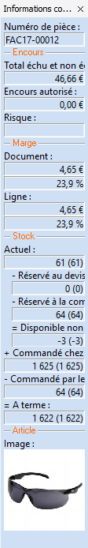

# Volet d'informations contextuelles

La barre d'information est accessible à partir du menu Affichage/Barre 
 d'informations. Cette barre latérale positionnable, s’affiche par défaut 
 à droite de la fenêtre Gestimum.

 

Les informations affichées varient en fonction document ouvert et de 
 la liste affichée. Les données affichées associées au document de vente 
 ouvert sont :

* Entête du document
* Le N° de pièce,
* Le total échu et 
 non échu,
* L'encours autorisé,
* Le risque,
* La marge de la 
 ligne et le taux de marge,
* La marge du document 
 et le taux de marge,
* Le stock (Actuel, réservé...),
* L'image de l'article.

