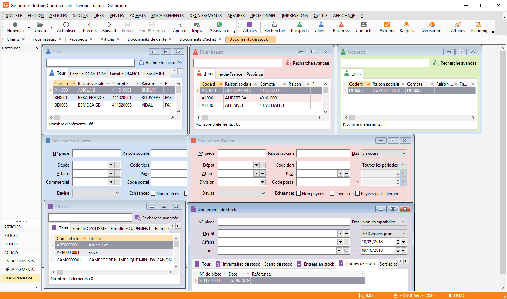
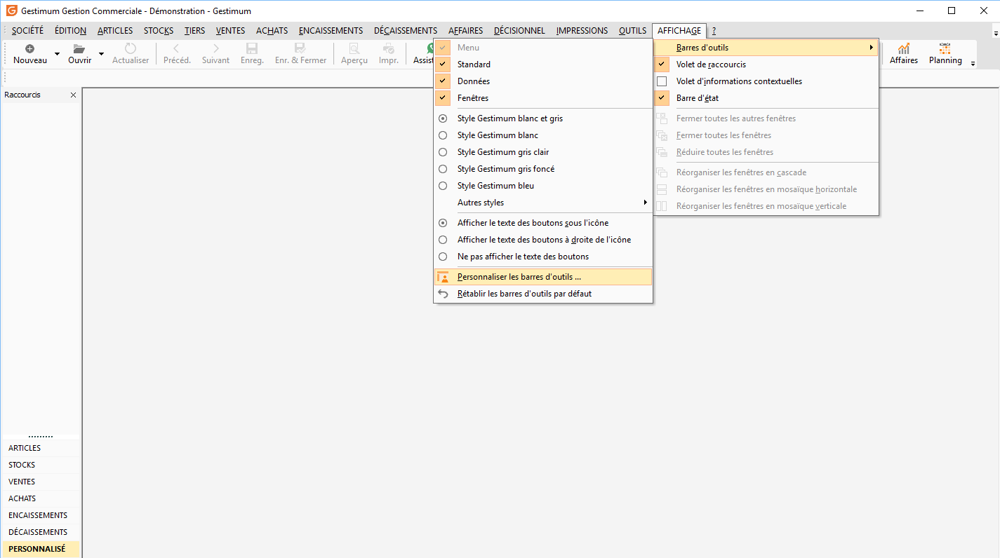
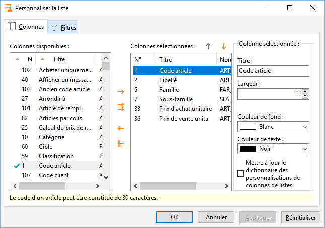
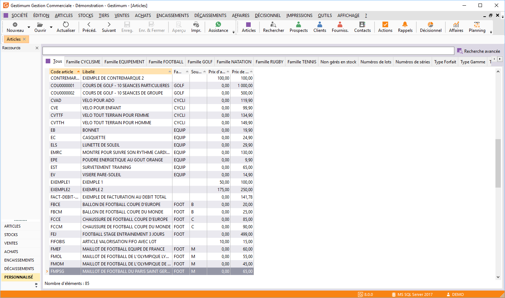
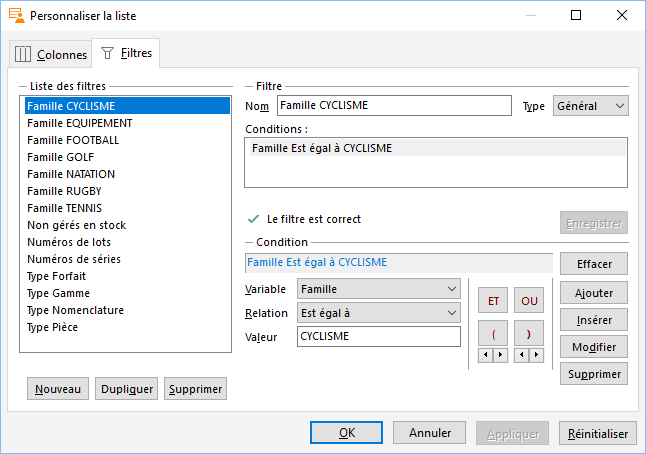
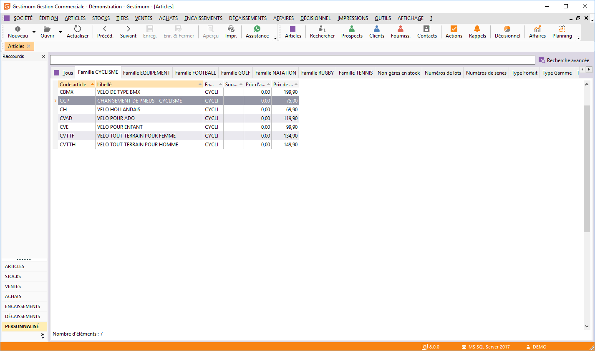
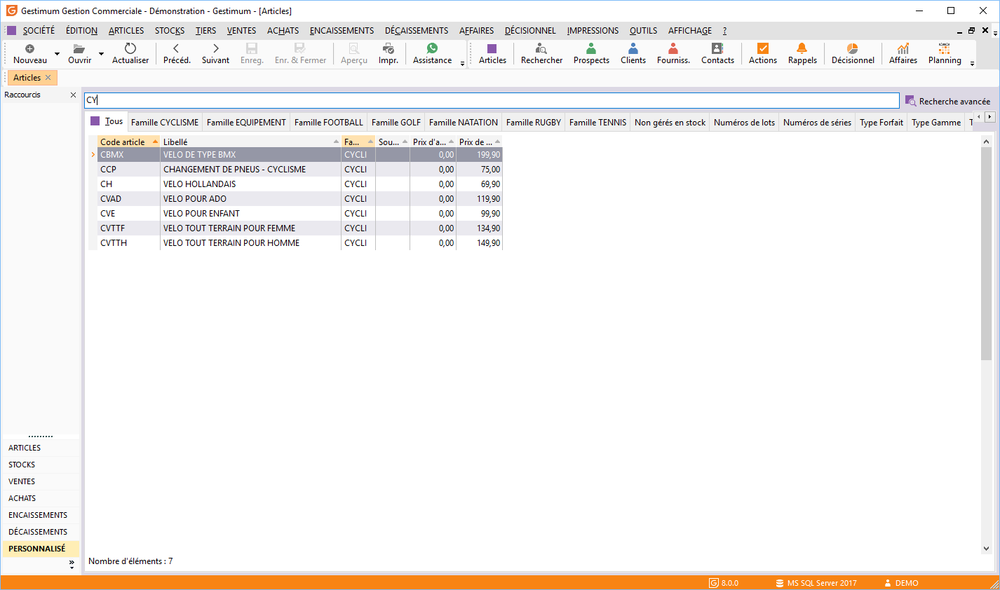
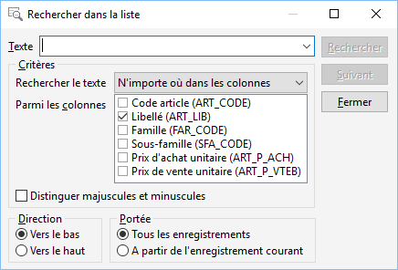
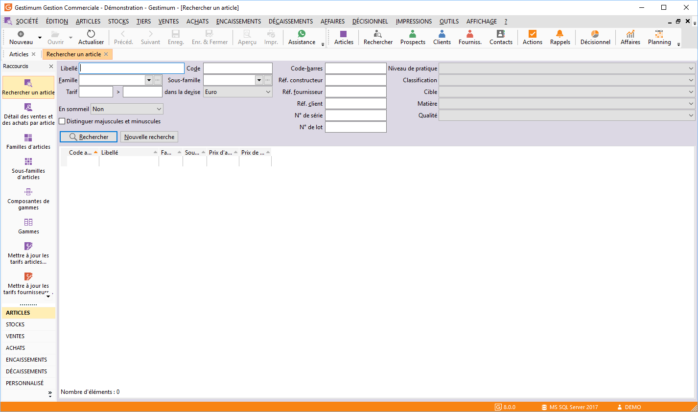
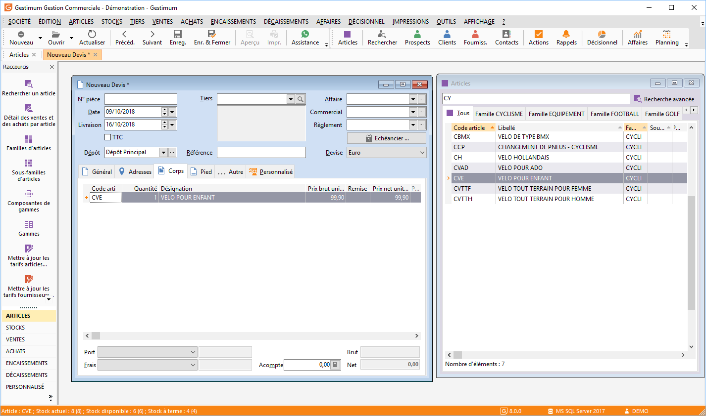

# Ergonomie et personnalisation

## Couleurs

Afin de faciliter et sécuriser la saisie, Gestimum ERP est construit autour 
 de codes couleurs, valables aussi bien en Gestion Commerciale qu’en Comptabilité.

 

Les fonds d’écrans sont :

* Vert pour les Prospects
* Bleu pour les Clients 
 / Documents de ventes
* Rouge pour les 
 Fournisseurs / Documents d’achats
* Mauve pour les 
 Stocks

 

## Personnalisations

### Menu

Allez dans "AFFICHAGE/Barre d’outils/Personnaliser 
 les barres d’outils".

 

 

Vous pouvez sélectionner une commande et la 
 glisser vers les raccourcies.

 

### Listes

Dans toutes les grilles d’affichage du produit, 
 un clic droit dans "Personnaliser la liste" permet d’ajouter 
 une multitude de champs disponibles pour compléter l’affichage.

 

 

Ces paramétrages sont sauvegardés et conservés 
 dans les fichiers "Gestimum.Preferences" et "Gestimum.Grilles" 
 dans le répertoire : C:\Users\NomUtilisateur\Application Data\Gestimum.

 

Exemple : Allez dans la liste des articles (ARTICLES/Articles) 
 puis faites clic droit "Propriétés de la grille". Ici vous pourrez 
 rajouter les champs des "colonnes disponibles" vers les "colonnes 
 sélectionnées" afin de voir ces champs dans la liste de vos articles.

 

Également sur la droite de cette fenêtre vous pouvez :

* Modifier l’intitulé 
 de la colonne,
* Modifier la largeur,
* Modifier la couleur 
 de fond,
* Modifier la couleur 
 de texte.

  
Une fois les champs sélectionnés, ils seront 
 visibles dans la liste de vos articles.

 

 

Dans les listes d’affichage (faites clic droit 
 "Personnaliser la liste" puis cliquez sur l’onglet "Filtres"), 
 la création de filtres est possible pour affiner les recherches. La combinaison 
 de variables est illimitée et affectable soit à un utilisateur, un groupe 
 ou l’ensemble des utilisateurs.

 

 

Dans l’exemple, une fois les filtres créés, 
 ils seront visibles dans la liste de vos articles

 

## Outils de recherche

Lors d’une recherche, il faut d’abord sélectionner 
 la colonne de référence, celle-ci sera identifiée en étant de couleur 
 orange.

 

La fonction de recherche dans les listes portera 
 sur la ou les colonne(s) sélectionnée(s), le "%" peut être utilisé 
 pour rechercher une partie du nom.

 

Il y a une fonction de recherche avancée, dans 
 la barre des tâches

## Glisser déplacer

La fonction Glisser/Déplacer peut être utilisée 
 entre la liste article et un document.

 
  
Pour utiliser cette fonctionnalité, il faut 
 ouvrir simultanément les fenêtres :

* Du nouveau document,
* De la liste articles.

