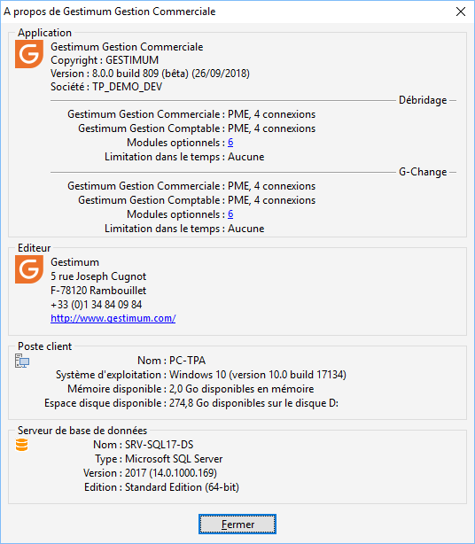

# A propos de

Cette fenêtre est accessible par le menu ?.

 

Elle vous informe sur :

* l'application que 
 vous utilisez (sa version et le nom de la société ouverte)
* le nombre de connexions 
 qui vous avez ainsi que les modules optionnels
* l'adresse de Gestimum
* le poste client 
 que vous utilisez (son nom, la version de Windows, la mémoire disponible 
 et l'espace disponible sur le disque)
* le serveur de base 
 de données qui stocke la base de données (son nom, la version et l'édition 
 de SQL Server)

 

 

Lors d'un appel à l'assistance, vous pourrez 
 être amené à nous communiquer une de ces infos. Si vous 

