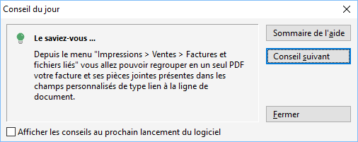

# Conseil du jour
Cette fenêtre vous permet d'avoir des astuces sur certains points du 
 logiciel. 

 

Vous pouvez soit venir la consulter de manière ponctuel en allant dans 
 le menu "?/Conseil du jour", soit ouvrir cette fenêtre de manière 
 systématique à l'ouverture du logiciel en cochant la case "Afficher 
 les conseils au prochain lancement du logiciel.

 

