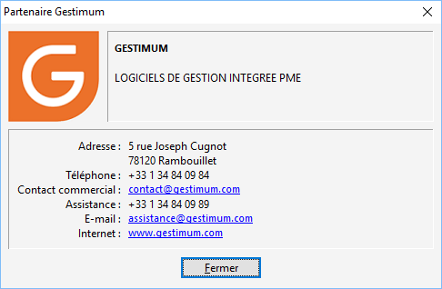

# Partenaire Gestimum

Gestimum propose à tous ses partenaires, la possibilité de personnaliser 
 leurs propres coordonnées dans un menu qui leur a été réservé : "?/ 
 Partenaire Gestimum". Cette option leur permettra d’afficher directement 
 dans Gestimum, leur raison sociale, adresse e-mail, site Web, coordonnées 
 téléphoniques, ainsi que leur propre logo.

 

Cette solution peut être mise en place automatiquement à partir de l’installation 
 de Gestimum en associant un fichier de paramétrage qui permet la visualisation 
 de ce menu.

## Paramétrage et installation

Le fichier associé doit obligatoirement porter 
 le nom suivant sans aucune modification : Gestimum.Partenaire.

 

Avant installation ou mise à jour de Gestimum, 
 le fichier doit être correctement paramétré (voir paramétrage ci-dessous).

 

Deux cas de figure seront gérés pour la mise en place de cette fonctionnalité 
 :

### Installation ou mise à jour de Gestimum joignant les deux fichiers 
 de paramètres

Vous devez installer ou effectuer une mise à jour de Gestimum et votre 
 fichier est correctement paramétré, placez lors de l’installation dans 
 le même répertoire l’exe d’installation de Gestimum et le fichier Gestimum.Partenaire.

 

Lors de l’installation, Gestimum crée un nouveau répertoire dans "C:\Program 
 Files\Gestimum\Partenaire", ce répertoire contiendra le fichier Gestimum.Partenaire.

### Installation ou mise à jour de Gestimum sans les fichiers paramètres

Après installation, vous pouvez créer manuellement le répertoire "Partenaire" 
 dans "C:\Program Files\Gestimum\" et placer manuellement votre 
 fichier de paramètres correctement renseignés.

 

Remarque Ce 
 fichier de paramètres n'est pas sauvegardé par la sauvegarde Gestimum.

## Structure du fichier Gestimum.Partenaire

Gestimum fourni un fichier type composé des éléments suivants qui doivent 
 être correctement renseignés ou laissés à vide si non utilisés

 

| [Partenaire] |   |
| Logo=Logo.png | Permet d'indiquer le chemin vers le logo à afficher |
| RaisonSociale.Ligne1=GESTIMUM
RaisonSociale.Ligne2=LOGICIELS DE GESTION INTEGREE PME | Ces 2 zones vous permettent renseigner votre raison sociale 
 et son complément |
| Adresse.Ligne1=5 rue Joseph Cugnot
Adresse.Ligne2=78120 Rambouillet | Ces zones servent pour indiquer votre adresse |
| Telephone=+33 1 34 84 09 84 |   |
| ContactCommercial=contact@gestimum.com |   |
| [Assistance] |   |
| Assistance=+33 1 34 84 09 89 |   |
| Email=assistance@gestimum.com |   |
| Internet=www.gestimum.com |   |
| Message.Ligne1=Vous pouvez nous contacter
Message.Ligne2=de 9h a 12h30 et de 14h a 18h |   |
| Telephone=+33 1 34 84 09 99 |   |
| Email=assistance@gestimum.com |   |
| PriseMainDistance=http://www.gestimum.com/Webassistance/G-en-ligne.exe | Cette info sera repris dans le menu "?/Assistance en ligne" |
| Internet=www.gestimum.com/service |   |

### Aperçu

Remarque

Le menu Gestimum/Partenaire Gestimum ne sera pas visible si le répertoire 
 partenaire et les fichiers de paramétrage ne sont pas sur le poste de 
 travail.

 

L’installation ou la création manuelle de ce répertoires avec la copie 
 de fichiers doit être effectuée sur chaque poste utilisateur.

