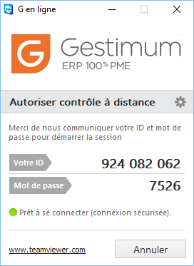

# Assistance en ligne
Ce menu permet à l'assistance de faire une prise en main temporaire 
 sur votre PC afin de visualiser avec votre écran.

 

Lorsque vous lancez l'assistance en ligne, vous avez un logiciel qui 
 se lance sur votre poste. Celui affiche alors un identifiant de session 
 unique et son mot de passe. Ces 2 éléments se renouvelle à chaque lancement 
 du logiciel de prise en main à distance et ne sont pas stockés. Dès que 
 le logiciel est fermé, la connexion est définitivement coupé.

 

 

