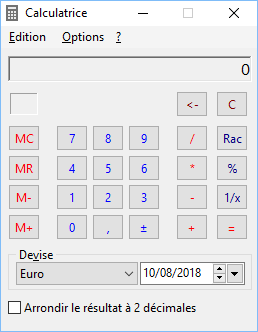
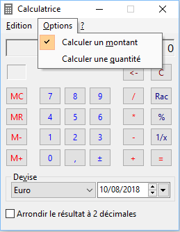
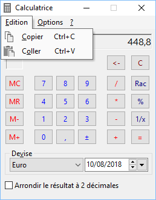

# Calculatrice

La calculatrice peut être appelée à partir du menu OUTILS | Calculatrice.

 

Elle permet d'effectuer toutes les opérations standard d'une calculette.

 

 

Elle permet de calculer 2 types de valeurs : quantité et prix.

 

Le choix du type se fait via le menu Options.

 

 

Elle gère également l'historique des conversions de devise à une date donnée. On peut ainsi saisir un montant dans une devise et avoir la conversion à une autre date que celle du jour.

 

Elle permet aussi de copier le montant/quantité calculé pour le reporter dans n'importe quelle zone de saisie de Gestimum ERP.

 

On peut aussi coller une valeur provenant d'une zone numérique de Gestimum ERP.

 

 

L’icône de la calculatrice apparaît également dans les champs quantité et prix des documents.

 

Lorsque la calculatrice est appelée depuis un document (icône calculette), le bouton "Valider" transfère le résultat du calcul dans le document.

