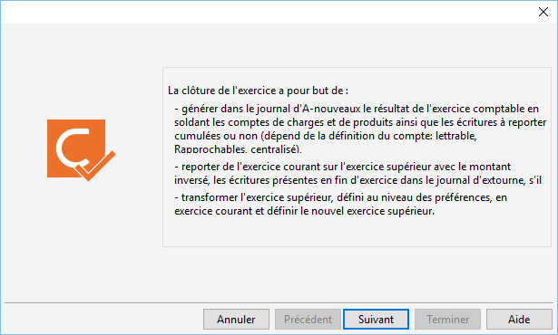
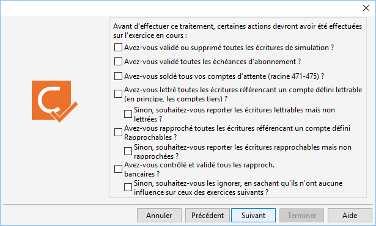
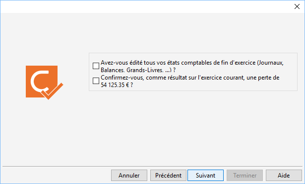
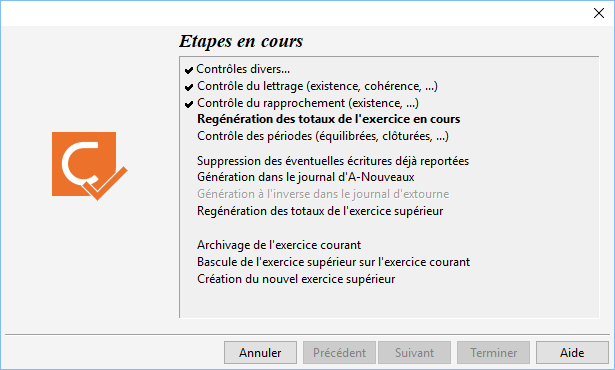

# Clôture annuelle comptable

La clôture annuelle consiste à passer l’exercice supérieur en exercice 
 courant.

 

Cette opération est à lancer avec précaution puisque les écritures ne 
 pourront plus être modifiées. De plus, si votre dossier de comptabilité 
 est lié à la gestion commerciale Gestimum, les pièces ne pourront plus 
 être modifiées.

## AVANT DE FAIRE LA CLÔTURE

Voici les étapes pour préparer et valider sa clôture comptable :

* Faire une sauvegarde
* Faire un inventaire
* Transférer les documents de la gestion 
 commerciale vers la comptabilité
* Faire un lettrage puis un contrôle du lettrage
* Valider les rapprochements bancaires puis 
 utiliser la fonction Outils | Recalculer 
 les totaux par compte et par journal
* Imprimer les différents documents comptables
* Vérifier de ne pas avoir d’écriture d’abonnement 
 en attente de génération, vérifier que les comptes d’attentes (compte 
 47) soient soldés et vérifier dans le centralisateur qu’aucun journal, 
 pour une période donnée, ne soit déséquilibré puis valider l’ensemble 
 des journaux
* Faire une nouvelle sauvegarde
* Lancer la clôture comptable (Attention 
 personne ne doit être connecté sur Gestimum lors de cette étape)

## MODALITÉS POUR POUVOIR EFFECTUER LA CLÔTURE ANNUELLE

### Exclusivité

La base doit être ouverte de manière exclusive. Si un seul utilisateur 
 travaille sur le dossier, le logiciel connecte automatiquement le dossier 
 en ouverture exclusive. Dans le cas contraire, un message d’avertissement 
 informe qu’un autre utilisateur est sur la base et donc que la clôture 
 est impossible.

### Droit

Vous devez avoir sélectionné par le menu SOCIETE 
 |Utilisateurs le droit Annuelles sur l’option Écritures/Clôtures 
 pour pouvoir lancer ce traitement.

### Dossier de gestion

Si votre dossier de gestion commerciale Gestimum est lié à votre dossier 
 de comptabilité Gestimum, les documents doivent tous être transférés en 
 comptabilité.

 

Mais attention, vous devez transférer vos pièces en comptabilité avec 
 le type de transfert "Gestimum" (transfert direct en comptabilité 
 Gestimum). Suite à la clôture, les documents de l’exercice clôturé pourront 
 être dupliqués, imprimés mais pas modifiés car ils ont été transférés.

## TRAITEMENT DE LA CLÔTURE ANNUELLE

Un assistant vous guide dans les différentes étapes de la clôture.

 

 

Le 2eme écran vous informe des actions spécifiques que le traitement 
 va effectuer pour :

* les comptes de charges et de produits
* les comptes définis comme lettrable
* les comptes définis comme rapprochable
* les comptes définis comme centralisable

 

 

Pour les comptes n’appartenant pas à ces définitions, vous devez choisir 
 entre 3 options :

* Les écritures sont cumulées comme un compte centralisé : Une 
 écriture dans le journal des  à-nouveaux représentera le solde 
 des écritures saisies au cours de l’exercice que vous clôturez,
* Les écritures sont reportées à l’identique,
* Suivant l’option au niveau du compte, cumulées ou reportées 
 à l’identique.

 

Le 3eme vous demande de confirmer si vous avez effectué différentes 
 opérations :

* Validation 
 ou suppression des écritures de simulation
* Validation 
 des écritures d'abonnement
* Solde 
 des comptes d'attente
* Lettrage 
 des comptes de type "lettrable"
* Rapprochement 
 des écritures d’un compte défini comme "rapprochable"
* Contrôle 
 et équilibre des rapprochements 
 bancaires effectués

 

 

L’écran suivant vous demande de confirmer :

* Que vous avez édité tous les états comptables
* Que vous êtes d’accord avec le résultat 
 trouvé

 

 

Ensuite, vous devez renseigner les données utiles pour la création des 
 journaux :

* D’a-nouveaux, avec sélection les comptes de bénéfice et de perte 
 ainsi que les libellés associés aux écriture
* Et d’extourne (journal de type OD)

 

 

Enfin, il affiche des différentes étapes en cours de traitement :

* Contrôle du lettrage (si déséquilibre, 
 blocage de la clôture)
* Contrôle du rapprochement (si déséquilibre, 
 vous avez le choix de bloquer ou non le traitement de la clôture)
* Regénération des totaux de l’exercice en 
 cours
* Équilibre (si déséquilibre, blocage de 
 la clôture) et Validation des Écritures (par période et journal)
* Suppression des écritures déjà reportées 
 lors d’une clôture provisoire antérieure
* Génération du journal d’A nouveaux,
* Éventuellement génération du journal d’extourne
* Regénération des totaux de l’exercice supérieur
* Archivage de l’exercice courant
* Bascule de l’exercice supérieur en exercice 
 courant
* Création du nouvel exercice

 

 

Une sauvegarde sera faite avant le début du traitement. Elle sera stockée 
 sur le serveur avec le nom :

Nom de la société + "\_" + Date du jour au 
 format AAAAMMJJ\_HHMM + "\_SauvegardeAvantClotureComptable.bak"

 

A la fin du traitement, vous avez la possibilité de visualiser et d’enregistrer 
 [un rapport de clôture](RapportClotureAnnuelle.md).

 

Tant que les conditions de clôtures ne sont pas réunies, votre dossier 
 ne pourra être clôturé.

 

Pour avoir un exemple de rapport cliquez [ici](ExempleRapportClotureAnnuelle.md).

### REMARQUE

Le Bulletin Officiel des impôts 13 L-1-06 (Contrôle des comptabilités 
 informatisées) du 24 Janvier 2006 exige qu'une validation des écritures 
 comptables soit effectuée avant clôture. Traitement disponible dans Outils/[Validation des périodes](../1/ValiderPeriodes.md).

## CONTRÔLES À EFFECTUER APRÈS LA CLÔTURE

Vous devez vérifier différents points avant de poursuivre votre activité 
 :

* L’exercice supérieur doit être passé en 
 exercice courant,
* Les dates de saisie autorisée doivent être 
 au minimum les dates de l’exercice courant.

 

[Voir aussi](javascript:RelatedTopic0.Click())

Voir aussi (espace réservé)
 

1. [Liste des rubriques](#)

//<![CDATA[
 if( typeof( FilePopupInit ) != 'function' ) FilePopupInit = new Function();
 FilePopupInit('a1');
//]]>
