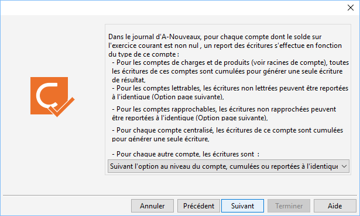
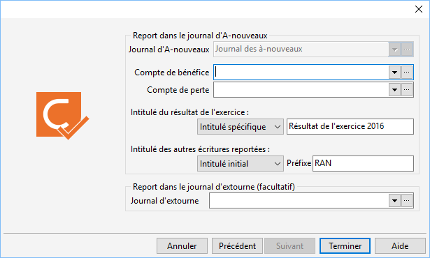

# Regénérer les écritures d'à-nouveaux

La regénération des AN est accessible à partir du menu Outils/Regenérer les écritures d'à-nouveaux.

 

La regénération des écritures d’à-nouveaux a pour but de recréer les 
 écritures dans le journal d’à-nouveaux à la date de la dernière [clôture annuelle](../2/ClotureAnnuelleComptable.md).

## Modalité pour pouvoir effectuer la regénération des AN

### Droit

Vous devez avoir sélectionné par le menu SOCIETE/Utilisateurs 
 le droit pour pouvoir lancer ce traitement.

### Obligation

Pour pouvoir régénérer les AN, vous devez avoir lancé au préalable au 
 moins une clôture annuelle.

## Traitement de la régénération des à-nouveaux

Un assistant vous guide dans les différentes étapes de 
 la regénération des à-nouveaux.

 

Cette regénération peut être réalisée :

* sur l’ensemble 
 des comptes (Complète)
* sur certains types 
 de comptes (Résultat, Lettrables, Rapproch. , Centralisés, Autres)
* sur un intervalle 
 de comptes
* sur un compte unique

 

Remarque : Si une écriture a 
 été lettrée ou rapprochée depuis la clôture annuelle, lors de sa regénération, 
 ce lettrage ou ce rapprochement est récupéré.

 

Le 2ème écran vous informe des actions spécifiques que le traitement 
 va effectuer pour :

* les comptes de 
 charges et de produits
* les comptes définis 
 comme lettrable
* les comptes définis 
 comme rapprochable
* les comptes définis 
 comme centralisable

 

Pour les comptes n’appartenant pas à ces définitions, vous devez choisir 
 entre 3 options :

* les écritures sont 
 cumulées comme un compte centralisé : une écriture dans le journal 
 des à-nouveaux représentera le solde des écritures saisies au cours 
 de l’exercice que vous clôturez

* les écritures sont 
 reportées à l’identique
* suivant l’option 
 au niveau du compte, cumulées ou reportées à l’identique

 

 

Ensuite, vous devez renseigner les données utiles pour la création du 
 journal des à-nouveaux, avec sélection les comptes de bénéfice et de perte 
 ainsi que les libellés associés aux écriture.

 

 

Suite au lancement du traitement (bouton "Terminer"), un message 
 de confirmation vous informe que tous les paramètres pour générer les à-nouveaux 
 sont corrects et vous demande de valider le lancement du traitement.

 

Enfin, il affiche des différentes étapes en cours de traitement :

* Regénération des 
 totaux de l’exercice en cours
* Génération dans 
 le journal d’à-nouveaux
* Regénération des 
 totaux de l’exercice supérieur

 

A la fin du traitement, vous aurez un message vous informant sur le 
 déroulement du traitement.

## Contrôles à effectuer après la régénération

Vous devez vérifier votre journal des à-nouveaux avant de poursuivre 
 votre activité.

