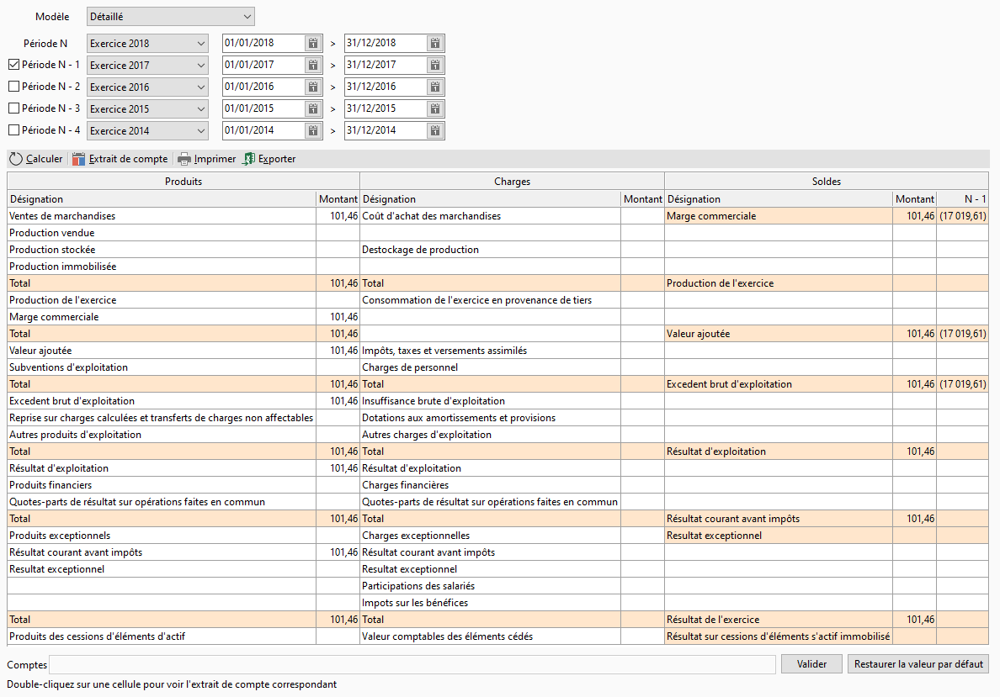

# Soldes intermédiaires de gestion

## Définition

Un solde intermédiaire de gestion (SIG) 
 est un indicateur de gestion qui est utilisé pour apprécier la gestion 
 d'une entreprise d'un point de vue analytique.

 

Issus de la nomenclature du plan comptable général (PCG), 
 les soldes intermédiaires de gestion s'appuient sur les mêmes éléments 
 comptables que le compte de résultat mais suivent un mode de calcul différent.

## Modèles

Quatre modèles de SIG sont 
 disponibles : [Détaillé](../2/ModeleDetaille.md), 
 [Service](../3-1/ModeleSimpleService.md), 
 [Distribution](../3-2/ModeleSimpleDistribution.md), 
 [Production](../3-3/ModeleSimpleProduction.md)

 

Voici une capture d'écran du modèle [Détaillé](../2/ModeleDetaille.md) 
 :

 

## Période

On choisit une période prédéfinie, ou on renseigne les dates dans les 
 champs correspondants. Les autres périodes se mettent à jour avec une 
 année de moins.

 

On peut sélectionner d’autres périodes à afficher en cochant les cases 
 correspondantes (N-1, N-2...).

## Calculs

La formule de calcul des différents soldes 
 est affichée dans la zone de texte "Comptes:" en bas de la fenêtre.

 

L’utilisateur peut choisir de la modifier et ainsi recalculer les soldes 
 une fois cliquer sur le bouton valider puis recalculer.

 

A tout moment il peut réinitialiser ses changements par ceux de base 
 en cliquant sur "Par défaut".

 

Les calculs qui commencent par "Éléments :" ou "Lignes 
 :" ne sont pas modifiables.

## Extrait de compte

Un double clic sur une zone permet d'afficher l'extrait de compte du 
 calcul correspondant.

## Imprimer, Exporter

Un clic sur Imprimer ouvre la fenêtre 
 d’impression, Exporter permet un export 
 du document vers Excel, également accessible depuis un clic droit.

