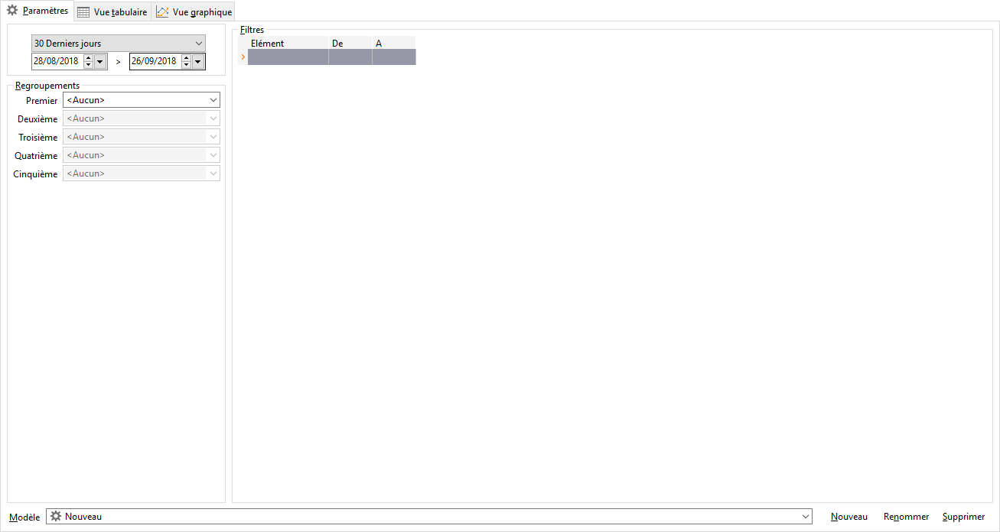

# Paramètres
Pour obtenir des statistiques ciblées sous forme de [tableau](OngletVueTabulaire.md) 
 et de [graphique](OngletVueGraphique.md), vous devez paramétrer 
 un modèle avec la période, le ou les niveaux de regroupement et éventuellement 
 les filtres.

 

## Période

Le calcul des statistiques prendra en compte uniquement les documents 
 réalisés sur cette période.

## Regroupements

Parmi les cinq regroupements possibles, le premier doit obligatoirement 
 être renseigné.

 

Les critères de regroupement disponibles sont les suivants :

* période 
 : année, année + trimestre, année + mois, année + semaine, trimestre, 
 mois, semaine, jour ou date
* affaires 
 : code Affaire, état de l’affaire, catégorie ou sous-catégorie d’affaire
* tiers 
 : code tiers du document, code tiers payeur/acheteur, famille, sous-famille 
 de tiers, critères tiers, code postal, ville, département, état ou 
 région
* Les articles 
 : code article, type article, catégorie, famille, sous-famille d’article, 
 critères article ou composants
* services, 
 divisions
* pays 
 : code pays, familles de pays, continents, groupements de pays
* commerciaux
* dépôts

## Filtres

Par défaut, les statistiques vont se calculer sur la totalité des données. 
 Si vous souhaitez limiter le calcul des statistiques à une fourchette 
 de données, il est nécessaire de définir des filtres.

 

Un filtre est composé de l’élément (à sélectionner dans la liste déroulante) 
 sur lequel le filtre va être appliqué et du premier et dernier code de 
 la fourchette.

 

Par le menu contextuel, vous avez la possibilité d'insérer ou de supprimer 
 une ligne. Celui-ci vous permet également d'accéder aux fonctions générales 
 des grilles.

## Modèle

Vous pouvez enregistrer tout le paramétrage d’une statistique dans un 
 modèle.

 

Ces modèles sont enregistrés dans le fichier "Gestimum.Statistiques" 
 qui se situe dans le même répertoire que l'exécutable Gestimum.

#### Création et appel d’un modèle

Avant de choisir vos critères (dates, regroupements, filtres), vous 
 devez cliquez sur nouveau et indiquez le nom du nouveau modèle.

 

Ensuite, vous pouvez paramétrer votre statistique, le modèle sera sauvegardé 
 automatiquement.

 

A chaque appel du modèle, les critères seront automatiquement repris 
 et vous pourrez les modifier si nécessaire.

#### Renommer un modèle

Le bouton Renommer permet changer le nom du modèle sans toucher aux 
 critères associés.

 

Pour effectuer un changement de nom de modèle, sélectionnez le modèle 
 et cliquez sur le bouton renommer. Ensuite, saisissez le nom du modèle 
 que vous souhaitez.

#### Supprimer un modèle

Le bouton Supprimer permet d’effacer de la liste des modèles un modèle 
 que vous n’utilisez plus.

 

Pour effectuer cette suppression, choisissez le modèle que vous souhaitez 
 supprimer et cliquez sur le bouton supprimer. Un message vous demande 
 de confirmer la suppression.

