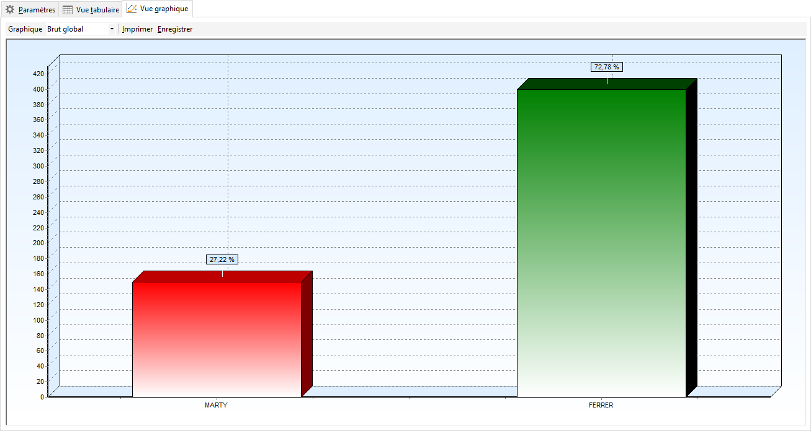

# Vue graphique

La vue graphique permet de visualiser sous forme de graphiques, les 
 informations de la vue tabulaire.

 

 

Par défaut, vous obtenez le graphique du brut global mais la liste déroulante 
 "Graphique" permet de sélectionner un autre type d’information

 

Par le menu contextuel, vous pouvez :

* Afficher 
 soit le code, soit le libellé du regroupement,
* Trier 
 suivant le code ou le libellé du regroupement de manière ascendante 
 ou descendante,
* Lancer 
 une impression non paramétrable.

 

Le graphique peut également être enregistré au format BMP, WMF ou EMF 
 pour une utilisation particulière.

