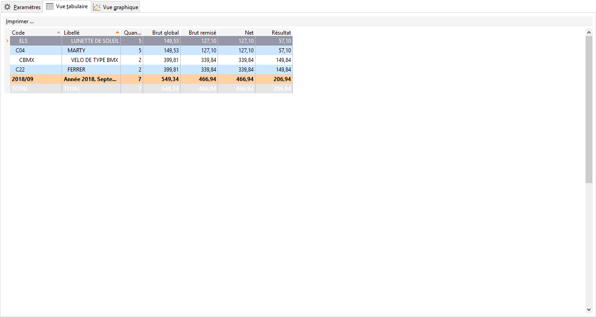
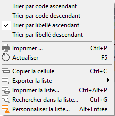

# Vue tabulaire

La vue tabulaire calcule pour chacune des données appartenant aux regroupements 
 renseignés, les montants suivants et les affiche sous forme de tableau 
 :

* Quantité
* Brut global
* Brut, qui tient 
 compte des remises en ligne (de 1à 6)
* Net, qui tient 
 compte des remises en ligne (de 1 à 6), de la remise accordée, de 
 la remise sur facture et de l’escompte accordé sur facture
* Résultat, qui est 
 égal à la différence entre le Net et le prix de revient des articles
* Total, qui tient 
 compte du Net, du port, des frais et frais supplémentaires
* ... et bien entendu 
 d’autres informations que vous pouvez activer par les propriétés de 
 la grille.

 

 

Le libellé repris est le libellé long des fiches (250 caractères).

 

Si le code et le libellé sont "vides", cela signifie qu’ils 
 reprennent l’ensemble des données répondant aux critères définis dans 
 l’onglet Paramètres, mais ne sont pas renseignés dans les lignes, documents/fiches…

 

Prenons par exemple le critère article, il est possible d’avoir une 
 ligne sans code, ni libellé. Cela signifie que dans un document, vous 
 avez saisi une ligne avec une quantité et un prix sans indiquer de référence 
 article.

 

Cette vue peut être triée suivant le code ou le libellé du regroupement 
 de manière ascendante ou descendante par le menu contextuel.

 

 

Il est possible d’imprimer ces lignes par le menu contextuel ou par 
 la barre d’outils en choisissant un modèle. L’impression de la grille 
 avec les champs principaux est toujours possible par le menu contextuel.

## Récupération sous Excel

Il est possible de récupérer ces lignes dans le tableur Excel afin d’exploiter 
 les informations qu’elles contiennent. Pour cela, cliquez simplement sur 
 le bouton  dans le menu "Export la liste". 
 Le logiciel ouvre alors l’application Excel et crée une feuille contenant 
 les informations de votre vue.

