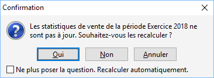

# Mise à jour des statistiques

Suite à la création, modification, … de documents, alors que vous êtes 
 sur la fenêtre des statistiques, un message peut apparaître. Il vous indique 
 que pour la période demandées les statistiques ne sont pas à jour et qu’ils 
 doivent être recalculés.

 

Vous avez la possibilité de :

* Confirmer 
 le recalcul
* Refuser 
 le recalcul
* Annuler 
 l’opération

 

Vous avez la possibilité de ne plus avoir ce message en cochant l’option 
 "Ne plus poser la question". Ainsi le recalcul des statistiques 
 s'effectuera automatiquement quelque soit la demande (modèle, période 
 , regroupement, …) et les modifications effectuées sur le dossier.

 

