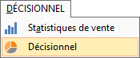
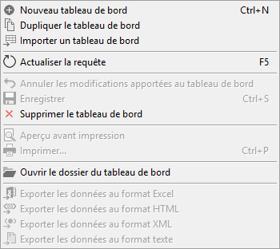
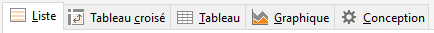
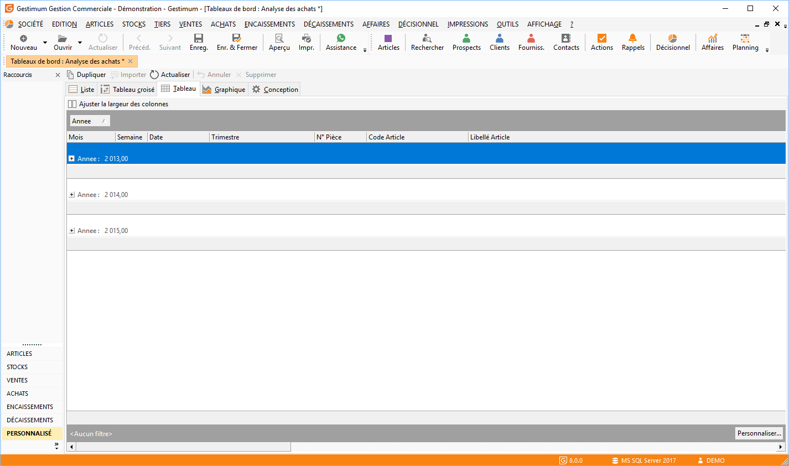

# Tableaux de bord

Cet outil décisionnel vous aidera à construire votre requête par la 
 simple sélection de tables de données, la sélection de champs, ainsi que 
 des filtres à appliquer.

## Paramétrages

### Dossier de stockage

Menu "SOCIETE | Paramétrage | Préférences 
 de l’utilisateur | Dossier des tableaux de bord".

 

Cette option permet de choisir un autre répertoire 
 que celui défini par défaut pour placer vos propres requêtes :

C:\ProgramData\Gestimum\Tableaux croisés

### Droits sur les tableaux de bord

Ce module est disponible dans la liste des droits 
 utilisateurs du menu "SOCIETE | Utilisateurs".

## Menu d'accès aux tableaux de bord

Via le menu "DÉCISIONNEL| 
 Décisionnel" :

 

## 

## Barre d'icônes

### 

### Dupliquer

Permet de dupliquer un TCD déjà existant. 

### Importer

### Actualiser

### Annuler

Annuler les modifications Importer une requête 
 : Accessible à partir de la liste de requêtes. Une fenêtre qui permet 
 de parcourir et sélectionner un fichier est affichée.

 

Le fichier d’import ayant ou non l’extension TDC pourra être importée. 
 Le logiciel analysera la validité de la requête et générera une nouvelle 
 requête avec l’extension TCD.

### Supprimer

Supprimer une requête de la liste .

## Menu Contextuel

### Nouveau

Une nouvelle page vierge est affichée et le 
 logiciel se place directement sur l’onglet conception. Le bouton Nouveau 
 sera accessible dès qu’une modification est effectuée dans cette fenêtre 
 pour permettre la création de la requête suivante. 

### Enregistrer

Permet la sauvegarde de la requête générée ou 
 modifiée.

Le nom du fichier, le nom de la requête et la description sont proposés.

Le fichier enregistré portera l’extension par défaut TCD. Cette extension 
 est non modifiable.

### Aperçu

Disponible dans les onglets : Vue multidimensionnelle, 
 données et vue graphique.

### Impression

Disponible dans les onglets : Vue multidimensionnelle, 
 données et vue graphique.

### Export de données

Disponible dans l’onglet Données.

Permet l’export de données vers un fichier au 
 format XML, XLS, HTML, Texte.

## Onglets

Les onglets sont affichés dans cette fenêtre 
 dans un ordre logique d’analyse, le ["Tableau 
 croisé"](../1-3/OngletTableauCroisé.md), le ["Tableau"](../4/OngletTableau.md) 
 et le ["Graphique"](../5/OngletGraphique.md) sont 
 le résultat de l’onglet ["Conception"](../6/OngletConception.md).

## Enregistrement des paramètres

Cet outil permet d’enregistrer les paramètres d’affichage de données, 
 résultat de requêtes.

### Tableau

Les regroupements (y compris l’ordre de regroupement) 
 des champs placés dans la bande de regroupement en haut de la fenêtre 
 et qui permettent de regrouper les lignes du tableau.

 

Les filtres des colonnes (défini dans le combo 
 qui s’ouvre dans l’en-tête de chaque colonne).

 

Le paramétrage de colonnes (largeur, etc).

### Tableau croisé

Le paramétrage du tableau : données colonnes 
 et lignes est enregistré.

### Graphique

Les champs activés pour les deux axes X et Y 
 Le type de graphique (Histogramme, courbe…).

 

Quand on modifie ce paramétrage et même sans avoir modifié la requête 
 elle-même, le bouton enregistrer devient actif, il faudrait alors enregistrer 
 pour le sauvegarder.

 

