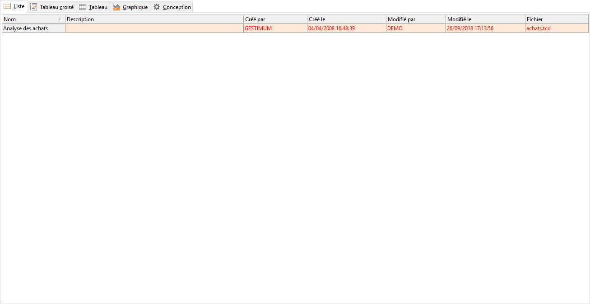

# Liste
Cet onglet affiche la liste des requêtes proposées 
 par défaut par Gestimum ainsi que toutes celles créées par l’utilisateur.

 

Elle est composée des colonnes suivantes : Nom, 
 Fichier, Description, 
 Crée par, Date 
 de création, Date de modification.

 

Le nom de la requête sélectionnée est affiché 
 dans la barre de titre de la fenêtre.

 

Les icônes disponibles dans la barre de menus 
 sont également accessibles par le menu contextuel.

 

