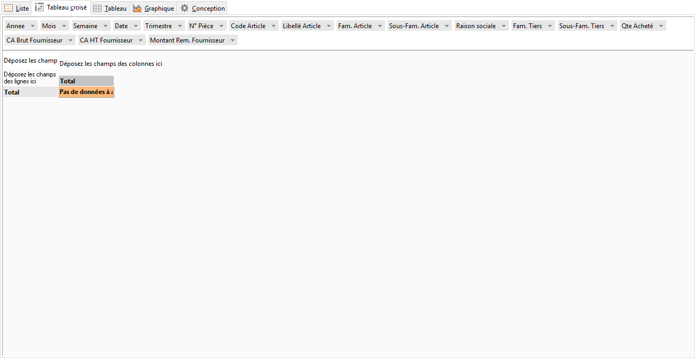
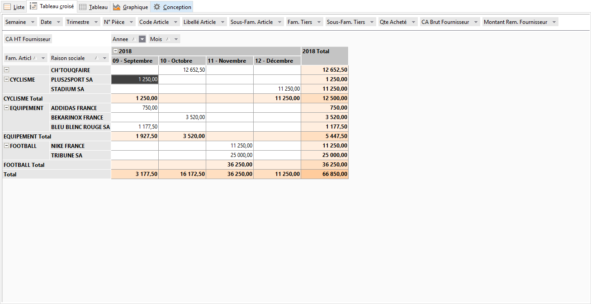

# Tableau croisé
Dans cet onglet vous pouvez construire une représentation multidimensionnelle 
 de données proposées résultant de la requête en cours définie dans l’onglet 
 Conception. 

 

Il existe trois zones disponibles pour contenir les champs qui servent 
 à construire la représentation de données :

* Zone champs de 
 Données : données à analyser
* Zone champs de 
 Lignes : paramètres ligne du tableau
* Zone champs de 
 Colonnes : paramètres colonnes du tableau

 

Les champs peuvent être déplacés à l’aide de la souris.

 

 

Certaines de ces données vous serviront de paramètres qui peuvent être 
 empilés suivant plusieurs dimensions possibles, d’autres seront utilisées 
 en tant que données d’analyse. 

 

A l’exécution de votre requête, tous les champs de données sélectionnés 
 dans chaque table sont disposés en haut de la fenêtre. Tout champ laissé 
 dans la zone Champs de données n’est pas impliqué dans la représentation 
 à construire. 

 

Cette fenêtre offre les fonctions suivantes :

* Un total 
 général au pied du tableau,
* Un sous-total 
 pour chacune de ruptures (d’après l’exemple: sous total client, famille, 
 sous famille),
* Des filtres 
 disponibles dans tous les champs,
* Dans l’entête des 
 colonnes et de lignes, le menu contextuel propose la possibilité "d’Afficher 
 ou cacher la liste de champs".

 

## REMARQUE IMPORTANTE

Avant de commencer la construction du tableau, l’objectif de votre analyse 
 doit être clair et bien défini. Il faut se poser la question "Que 
 voulez-vous analyser dans ces données ?" Consultez [l’exemple 
 proposé](../../2/ExempleUtilisation.md).

