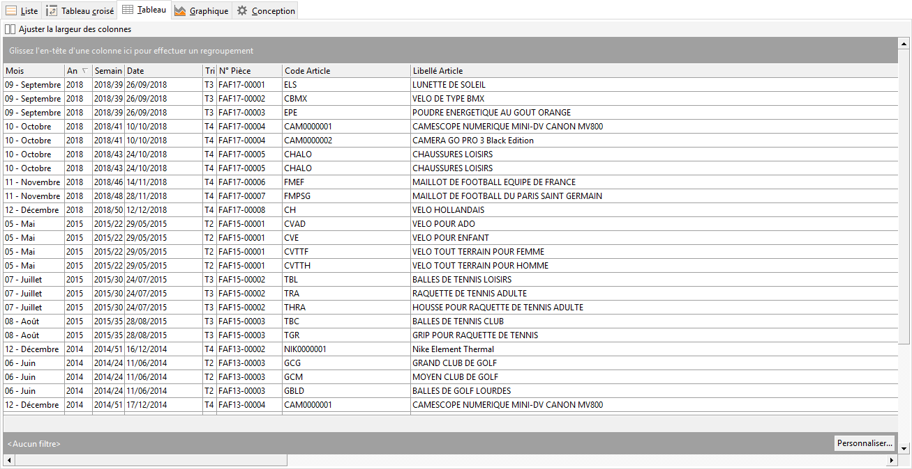
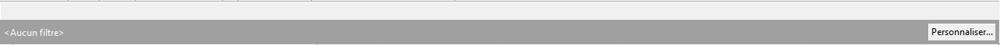
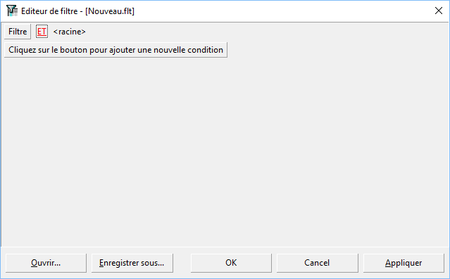
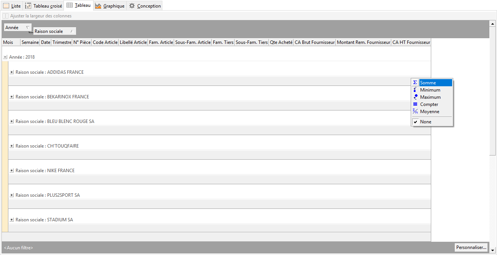
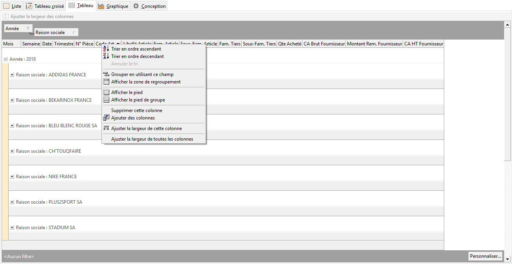

# Tableau
Cet onglet affiche de manière tabulaire 
 tous les champs ayant été choisi dans la conception de la requête après 
 application de filtres définis dans le volet de paramétrage de volet.

 

Cette fenêtre propose les fonctions suivantes : 

* des regroupements
* des filtres
* des calculs en pied : somme, moyenne

 

Pour créer, il faut glisser les champs des entêtes de colonnes à regrouper. 
 Les données seront affichées selon le ou les regroupements choisis. Les 
 filtres sont disponibles dans chaque champ.

 

 

L’option "Personnalisé" en bas à droite 
 propose différents choix de sélection des données pour affiner vos résultats.

 
 
   

 

Sur les lignes de totaux, le 
 menu contextuel (clic droit) propose un calcul adapté au type de donnée 
 : Somme, Minimum, 
 Maximum, Compter, 
 Moyenne.

 

 

L’icône Export de données propose l’export aux formats suivants : Excel, 
 XML, HTML, Texte. 

 

Sur la barre d’entête de colonnes, le menu contextuel propose les options 
 suivantes :

* Trier 
 dans l’ordre ascendant et descendant, ainsi qu’annuler le tri
* Grouper 
 en utilisant ce champ (équivalent à déplacer la colonne dans la barre 
 de regroupement)
* Afficher la zone de regroupement
* Afficher 
 le pied de page : Affiche ou non la barre de totalisation du 
 bas de page
* Afficher le pied de groupe
* Supprimer 
 cette colonne : Supprime la colonne de la barre de colonnes, 
 elle reste disponible dans la liste de champs,
* Ajouter 
 des colonnes : Affiche la liste des champs pour ajouter et 
 ou enlever des champs non nécessaires. Par défaut tous les champs 
 sélectionnés dans les tables sont disponibles dans la barre de colonnes
* Ajuster la largeur de la colonne sélectionnée
* Ajuster la largeur de toutes les colonnes

 

