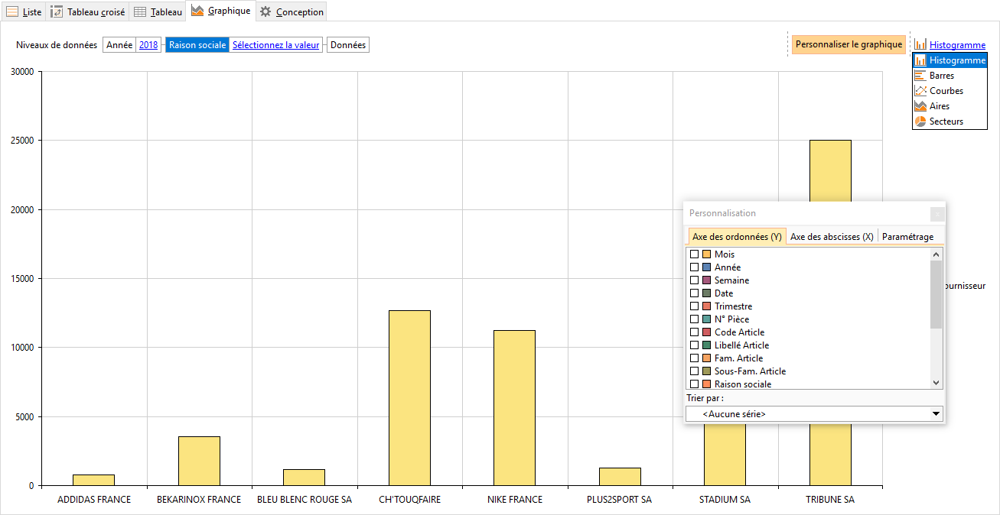

# Graphique
Cet onglet permet de représenter vos données en forme graphique, pour 
 obtenir cette représentation, vous devez placer les données à représenter 
 dans la partie supérieure de la fenêtre "Niveau de données».

 

Les données sont accessibles à partir du bouton "Personnaliser 
 le graphique» en haut à droite.

 

Ce bouton propose les onglets suivants :

 

* Axe 
 abscisses Y : Les données (données qui doivent être chiffrées) 
 choisis doivent être de valeurs qui varieront en fonction de données 
 sélectionnées dans l’axe X. Il suffit de cocher le champ souhaité 
 . Nous pouvons sélectionner par exemple le champ Montant TTC

 

* Axe 
 ordonnées X : Sur quoi on va comparer les données. Pour les 
 sélectionner, elle doivent être glissées/déplacées dans le Niveau 
 de données. Elles feront varier les montants de l’axe Y. Dans notre 
 exemple, nous pouvons choisir le code article puis la famille placée 
 à droite

 

* Paramètres 
 : Permet de configurer l’affichage de données. Pour modifier la présentation 
 du graphique, le bouton "Type de graphique» propose le choix 
 suivant :
+ Barres
+ Histogramme
+ Courbes
+ Aires
+ Secteurs

 

Dans la zone Niveau de données, 
 l’option "Sélectionner la valeur» permet d’affiner les données à 
 représenter.

 

Pour obtenir un affichage de la sous donnée Famille placée à droite 
 du champ Code article, il suffit de double cliquer sur la colonne d’un 
 code article affiché pour obtenir un sous graphique avec l’option "Sélectionner 
 la valeur» et affiner d’avantage l’affichage.

 

