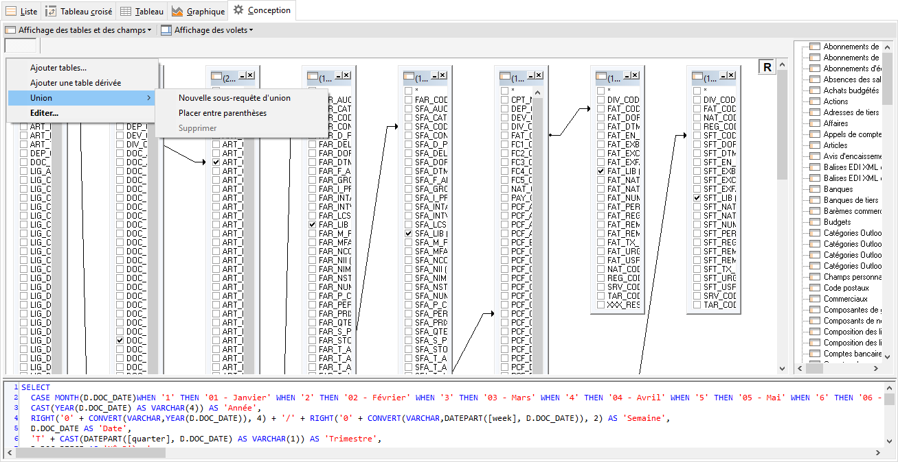
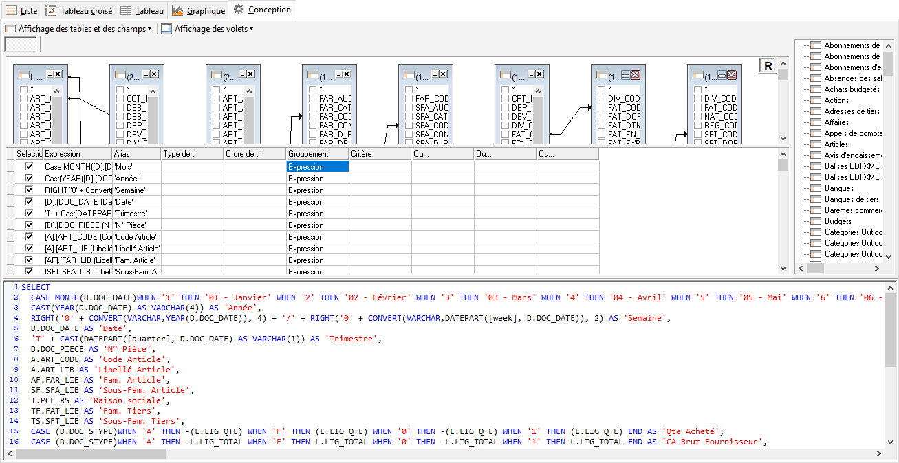

# Conception
Cet onglet destiné à la conception de la requête vous offre plusieurs 
 fonctions très puissantes.

 

Par la sélection des tables, des champs et les liens définis entre chaque 
 table et chaque champ, votre requête sera générée automatiquement.

 

 

Une option propose l’affichage des tables et 
 de champs de données avec ou sans le libellé de description, tries ou 
 non par ordre alphabétique.

 

La fenêtre est composée de trois parties :

## 1è partie : le volet des tables sélectionnées

Cette zone reste toujours affichée. 

 

Elle dispose des fonctions décrites ci-dessous, accessibles à partir 
 du menu contextuel :

 

+ Ajouter tables 
 : Même fonction que l’option "Afficher volet tables" 
 à droite de la fenêtre

 

+ Ajouter une 
 table dérivée : Opération qui permet d’ajouter une sous requête 
 dans la requête principale

 

+ Union : Option 
 qui permet :

 

- d’ajouter une nouvelle sous requête d’union

 

  

- de placer entre parenthèses

 

   

Éditer : Accessible également par l’icône permet l’ajout des options 
 affichées dans cette fenêtre dans la construction de la requête

 

Par exemple, après sélection de l’option DISTINCT, la requête se construit 
 comme suit:

Select Distinct \* From ACTIONS

 

## Le volet des expressions

Ce volet affiche les champs sélectionnés dans 
 chacune de tables. Les choix effectués dans cette partie se refléteront 
 sur les données proposées dans l’onglet Données.

 

Il est possible d’ajouter des clauses de filtre, de calcul et de groupement 
 dans la requête.

 

 
Il est possible d’ajouter des colonnes de calcul supplémentaires pour 
 permettre une analyse complète

 

Exemple : Si vous souhaitez calculer la commission de représentants 
 à partir de la marge en utilisant uniquement la table Documents qui contient 
 le tiers, le code représentant, la marge, le montant TTC, puis le montant 
 HT, il suffit de créer un champ variable supplémentaire

 

Sélectionnez dans la colonne Expression, le champ Marge, ajouter l’opération 
 de calcul 2%. Saisissez le nom de votre variable "Commission" 
 dans la colonne Alias

 

Cochez la colonne Sélection pour qu’elle soit visible dans l’onglet 
 Donnée

 

 

Dans l’onglet Données, on retrouve notre colonne Coût réel

 

## Le volet script SQL

Ce volet affiche la requête SQL générée automatique 
 d’après votre sélection de données, l’ajout des filtres et différentes 
 options disponibles. Les utilisateurs expérimentés pourront modifier et 
 adapter librement ce résultat.

 

 

