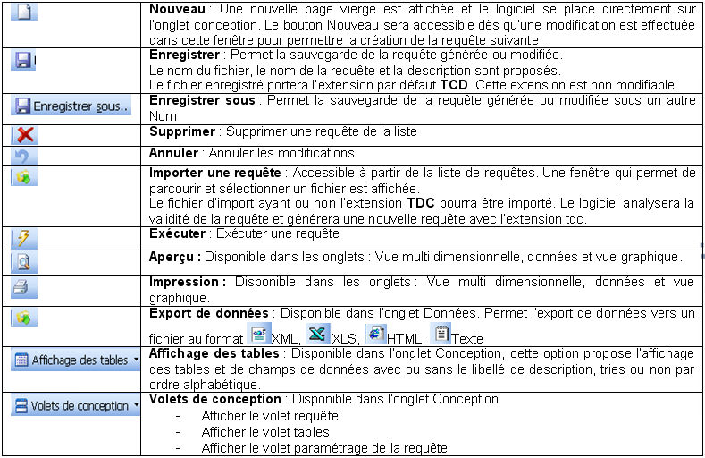

# Tableaux de bord 1

Cette nouvelle version des tableaux croisés dynamiques proposée par 
 Gestimum, vous offre plusieurs options supplémentaires pour vous permettre 
 une analyse puissant et complète de vos données.

 

Cet outil décisionnel vous aidera à construire votre requête par la 
 simple sélection de vos tables de données, la sélection de champs, ainsi 
 que des filtres à appliquer.

 

Il est accessible à partir du menu Traitements de la Gestion commerciale 
 et la de la Gestion comptable uniquement pour la version PME.

## Remarque

Ce nouveau module plus riche en fonctionnalités remplace l’ancien module 
 Tableaux Croisés des premières versions 3. 7 Inférieures à la build 400.

 

Pour récupérer vos anciennes requêtes saisies dans l’ancien module, 
 vous pouvez contacter notre service assistance.

## Remarque

La fonction « tableaux croisés dynamiques » et le requêteur SQL intégré 
 a pour objectif de faciliter l’obtention de statistiques ciblées sur l’exploitation 
 de l’entreprise avec un nombre limité de requêtes calculées simultanément 
 ; En cas de volumétrie importante (taille de la base de données, nombre 
 d’utilisateurs simultanés, nombre de requêtes calculées simultanément), 
 le risque de lenteur est important.

 

Dans ce cadre, les outils Microsoft de business Intelligence disponible 
 dans MS-SQL Server 2005 seront plus adaptés (SQL Server Integration Services, 
 SQL Server Analysis Services et SQL Server Reporting Services) en particulier 
 la brique « ETL » [Extract, Transform and Load] pour créer et alimenter 
 un data warehouse.

## Interface

### SOCIETE/Paramétrage/Préférences de l’utilisateur/ Requêtes de tableaux 
 croisés dynamiques

Cette option permet de choisir un autre répertoire que celui défini 
 par défaut pour placer vos propres requêtes ( C:\Documents and Settings\All 
 Users\Application Data\Gestimum\Tableaux croisés)

## Droits sur les tableaux croisés dynamiques

Ce module est disponible dans la liste des droits utilisateurs du menu 
 Fichier

## Icônes

