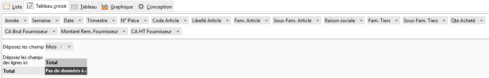
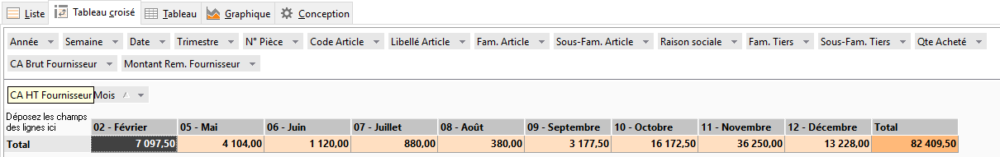
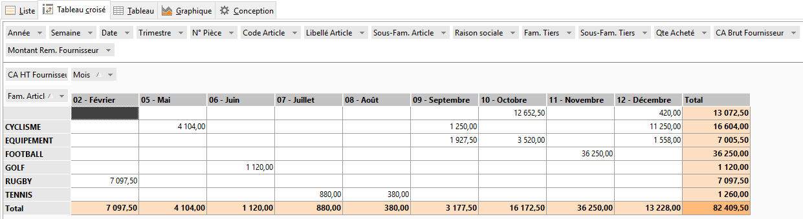
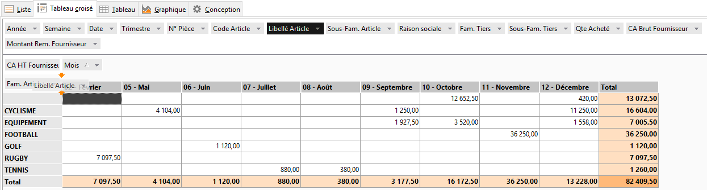
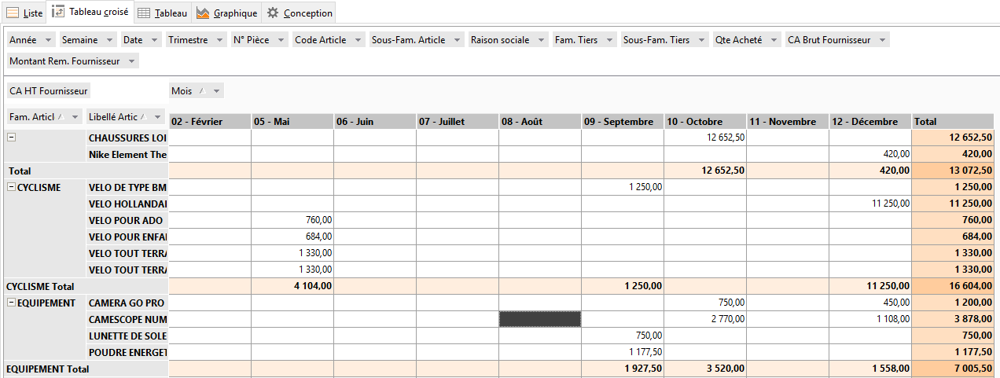
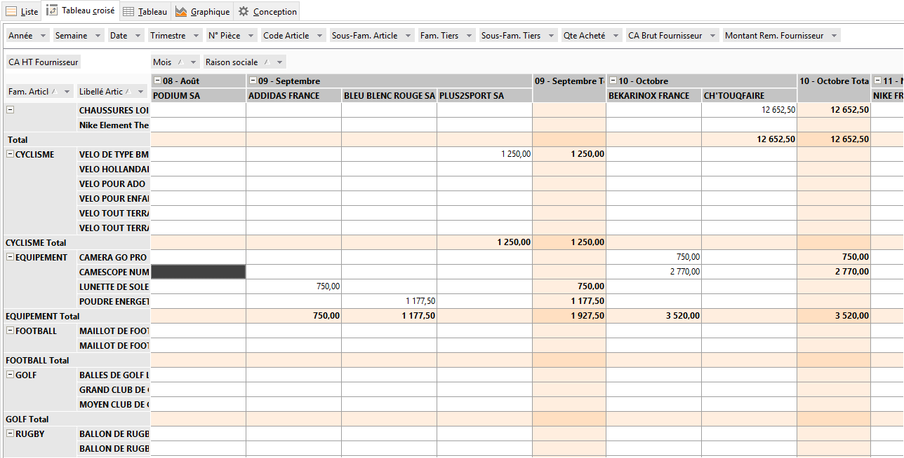
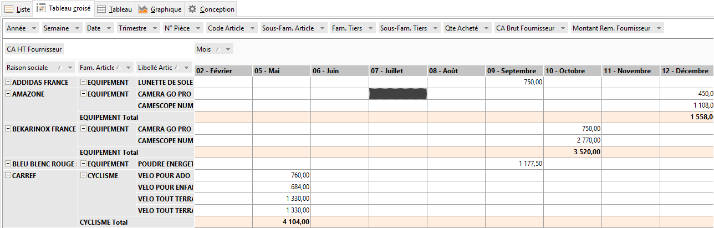
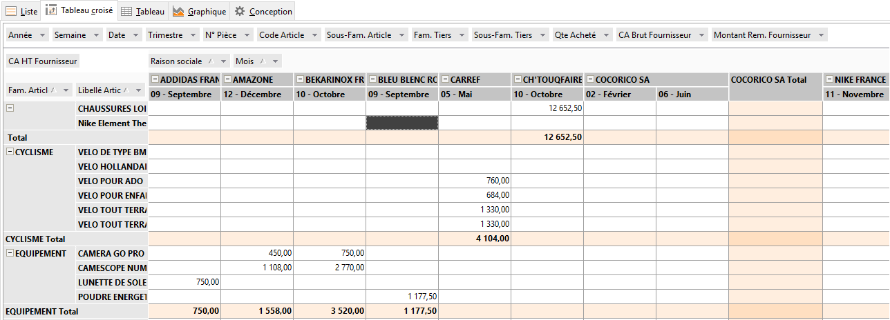

# Exemple d'utilisation
Un exemple illustrera de manière concrète et 
 significative la puissance de cet outil et facilitera sa compréhension.

 

Notre exemple part de la table Documents Lignes 
 et Tiers dans lesquelles ont été sélectionnés les champs : raison sociale, 
 Code article, Libellé, …. Montant HT. 

 

Dans notre exemple, on procédera progressivement 
 pour illustrer méthodiquement cette démarche.

 

La réponse à la question "Que voulez-vous analyser dans ces données 
 ?" est : représenter les achats par mois. Dans ce cas, notre donnée 
 unique est le chiffre d’affaire, et notre paramètre unique est le mois.

## Mois

Avec la souris déplacez le champ Mois vers la zone de Colonnes.

 

 

A ce stade rien ne s’affiche encore dans le tableau car les valeurs 
 ne s’affichent tant que la zone des données ne comporte aucun champ.

## CA HT Fournisseur

Placez le champ CA HT Fournisseur dans la zone de données :

 

 

Notez la notion de variation des données en 
 fonction des paramètres, chiffre d’affaire en fonction des mis. Cette 
 représentation est monodimensionelle.

 

Dans la vue multi-dimensionnelle, le contenu 
 du tableau est constitué de données.

## Famille d'article

Faisons maintenant évoluer notre représentation pour obtenir la variation 
 du chiffre d’affaire en fonction des mois et des familles d’articles. 
 Il suffit pour cela de déplacer le champ Famille d’article dans la zone 
 des lignes.

 

 

Maintenant notre vue est bidimensionnelle. Par simple clic de souris, 
 il est possible d’étendre vers d’autres dimensions, pour affiner notre 
 analyse.

## Libellé article

A cette étape, on souhaite obtenir en plus dans la même vue, le détail 
 des achats par article. Notre vue deviendra tridimensionnelle et pour 
 cela il suffit de déplacer le champ Libellé article vers la zone des lignes.

 

  

Un champ déposé à droite du champ qui est déjà dans la zone constitue 
 un détail. Un champ déposé à gauche constitue un groupement

 

Dans notre exemple les articles étant le détail de familles d’articles, 
 le champ Libellé article sera déposé à droite

 

 
## Raison sociale

En procédant de la même manière, il est possible d’affiner encore plus 
 notre analyse en ajoutant une quatrième dimension à notre vue de données. 
 

 

Supposons qu’on veut examiner en plus la répartition par fournisseur 
 des achats. Il suffit de glisser le champ Raison sociale à côté du Champ 
 mois dans la zone des colonnes pour obtenir ce résultat.

 

 

Remarquons enfin que cette quatrième dimension de la vue aurait pu être 
 introduite différemment : dans les lignes à gauche des deux champs qui 
 sont déjà présents ou dans les colonnes à gauche du champ mois pour avoir 
 des totaux par fournisseur.

 

 
 
  

 

Remarquons aussi qu’on retrouve bien, dans ces différentes représentations, 
 les achats de Lunette de Soleil effectués chez ADDIDAS France pour le 
 mois de Septembre. Il fait partie à chaque fois d’un regroupement différent 
 et c’est l’un des intérêts d’une telle analyse.

 

Cette dernière remarque nous conduit à attirer l’attention sur le fait 
 que cet outil permet d’atteindre un objectif d’analyse de données, la 
 construction de la vue devrait donc être guidée par cet objectif.

