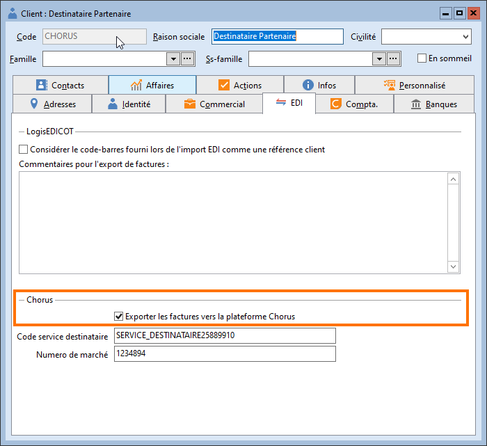
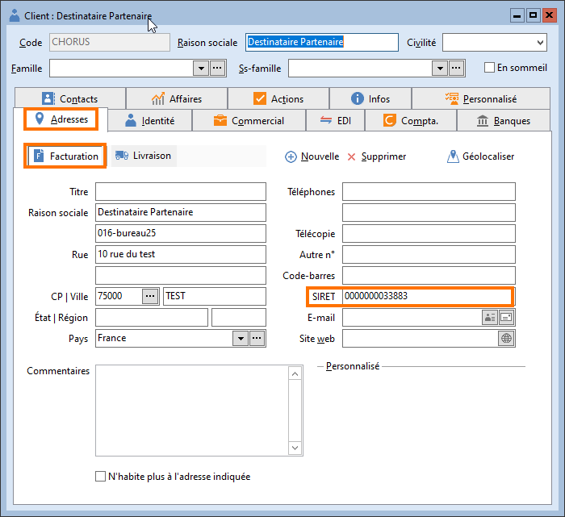
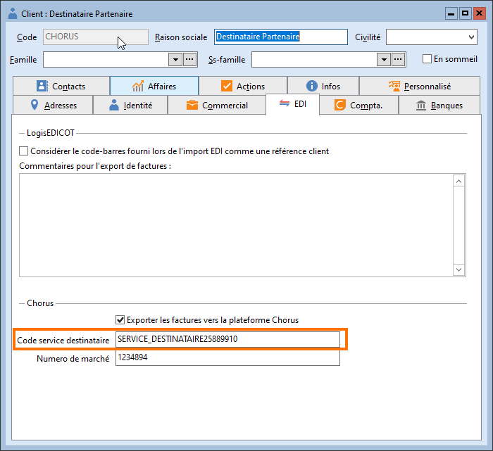
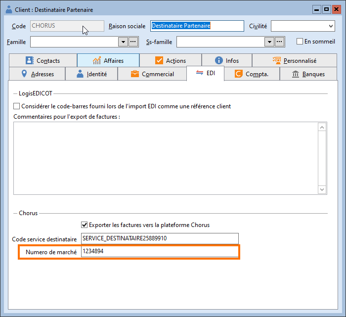

# Paramétrage des clients

## Option "Exporter les factures vers la plateforme Chorus"

Afin d’identifier les clients concernés 
 par l’export au format Chorus Pro, nous avons ajouté une option "Exporter 
 les factures vers la plateforme Chorus" dans l'onglet EDI de la fiche 
 client.

 

Il faut que cette option soit cochée pour 
 tous les clients concernés par l’export au format Chorus Pro. Dans le 
 cas contraire, les factures et avoirs ne pourront être exportés.

 

 

Pour tous les clients concernés par l’export 
 des documents au format Chorus Pro, il sera nécessaire de renseigner les 
 éléments suivants :

### SIRET

Renseigner un SIRET par adresse créée dans 
 l’onglet "Adresses" du tiers.

 

 

Si 
 cette information n’est pas présente, un message d’erreur sera généré 
 lors de l’export des fichiers EDI au format Chorus Pro.

### Code service destinataire

Saisissable dans l’onglet EDI de la fiche 
 tiers.

 

### Numéro de marché

Saisissable dans l’onglet EDI de la fiche 
 tiers.

 

 

Ces éléments 
 pourront également être renseignés manuellement lors de la création [des documents de vente](ParametrageFacturesAvoirsClients.md).

