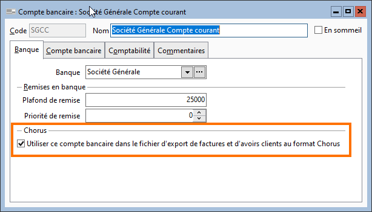

# Paramétrage du compte bancaire

Parmi les informations attendues par la 
 plateforme Chorus Pro, figurent les coordonnées 
 du compte bancaire sur lequel seront effectués 
 les règlements. 

 

Pour cela, vous devez définir quel sera 
 votre compte bancaire devant figurer dans les fichiers transmis aux administrations.

 

La liste des comptes bancaires est accessible 
 dans le menu SOCIETE | Comptabilité | Comptes 
 bancaires.

 

Dans le compte bancaire sélectionné, cocher 
 l’option "Utiliser ce compte bancaire dans le fichier d’export de 
 factures et d’avoirs clients au format Chorus", disponible dans l’onglet 
 "Banque".

 

 

Pour la création des banques et comptes 
 bancaires, se référer à la documentation sur ce sujet.

