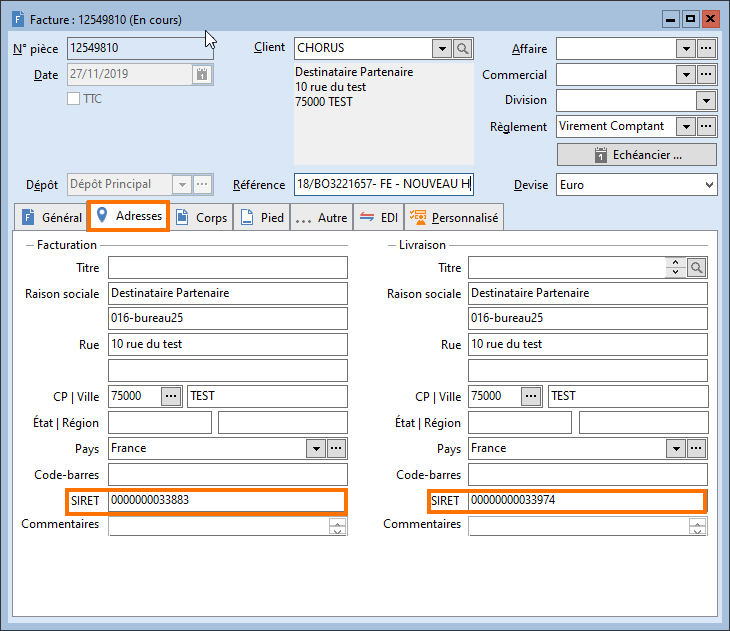
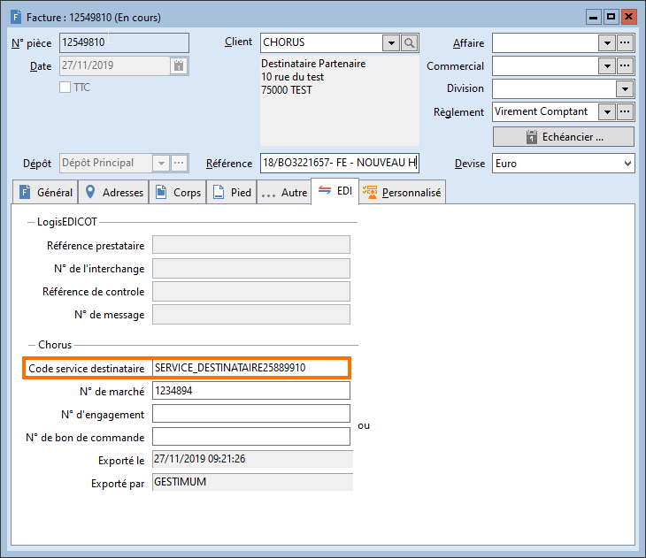
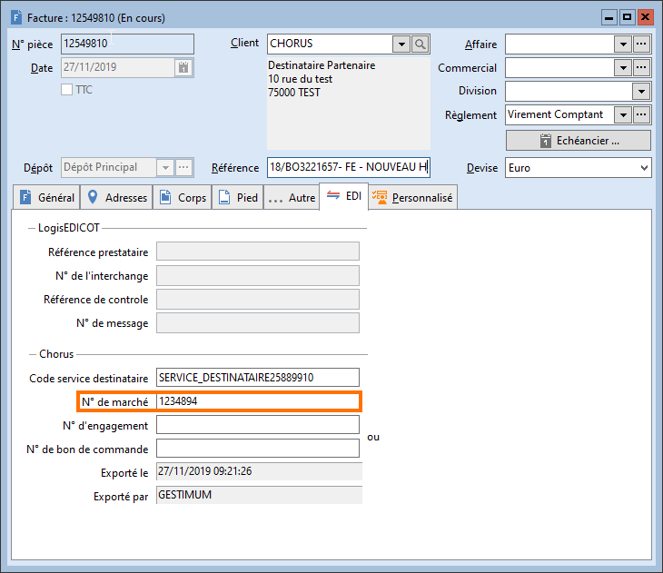
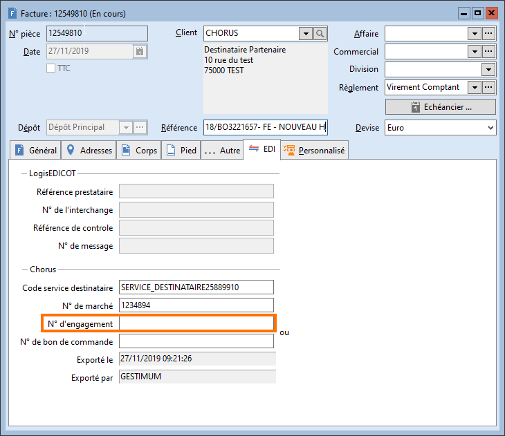
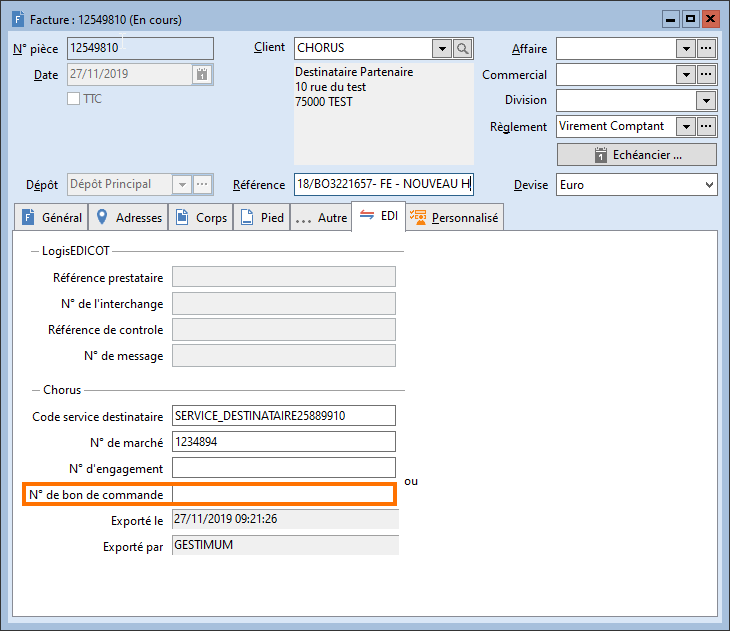

# Paramétrage des factures et avoirs clients

Si les différents champs précités dans [le 
 paramétrage des clients](ParametrageClients.md) ont été préalablement renseignés dans le tiers, 
 alors ils seront repris dans le document de vente.

 

Dans le cas contraire, vous avez la possibilité de les saisir directement 
 dans le document de vente.

## SIRET

Il est à saisir dans l'onglet "Adresses" 
 du document de vente.

 

 

C’est le SIRET de l’adresse de livraison qui sera remonté dans le fichier 
 au format Chorus Pro.

## Code service destinataire

Il est à saisir dans l'onglet "EDI" 
 du document de vente.

 

## Numéro de marché

Il est à saisir dans l'onglet "EDI" 
 du document de vente.

 

## Numéro d'engagement

Il est à saisir dans l'onglet "EDI" 
 du document de vente.

 

 

Attention, il ne peut pas être associé à 
 un numéro de bon de commande. Il faut renseigner l'un ou l'autre.

## Numéro de bon de commande

Il est à saisir dans l'onglet "EDI" 
 du document de vente.

 

 

Attention, il ne peut pas être associé à 
 un numéro d'engagement. Il faut renseigner l'un ou l'autre.

