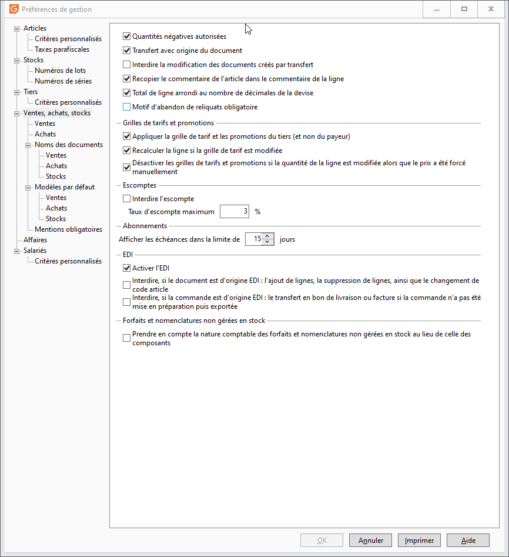

# Paramétrage des préférences

La mise en place de cette solution, nécessite l'’activation 
 des fonctionnalité d’EDI sur votre dossier Gestimum ERP.

 

Pour cela, aller dans le menu SOCIÉTÉ 
 | Paramétrage | Préférences de Gestion, dans l'onglet "Ventes 
 et Achats", dans la rubrique EDI, et cocher l'option "Activer 
 l’EDI".

 

 

Les autres options EDI présentes ne concernent 
 pas l'EDI Chorus Pro.

 

L’activation de l’EDI sur votre dossier 
 va vous permettre d’accéder aux différentes options de paramétrage dans 
 [les comptes bancaires](ParametrageCompteBancaire.md), [les clients](ParametrageClients.md) et [les 
 documents de ventes](ParametrageFacturesAvoirsClients.md).

 

Pensez également à renseigner vos conditions de pénalité dans l'onglet "Mentions 
 obligatoires", elles seront reprises dans le fichier EDI et doivent 
 apparaître dans le flux.

