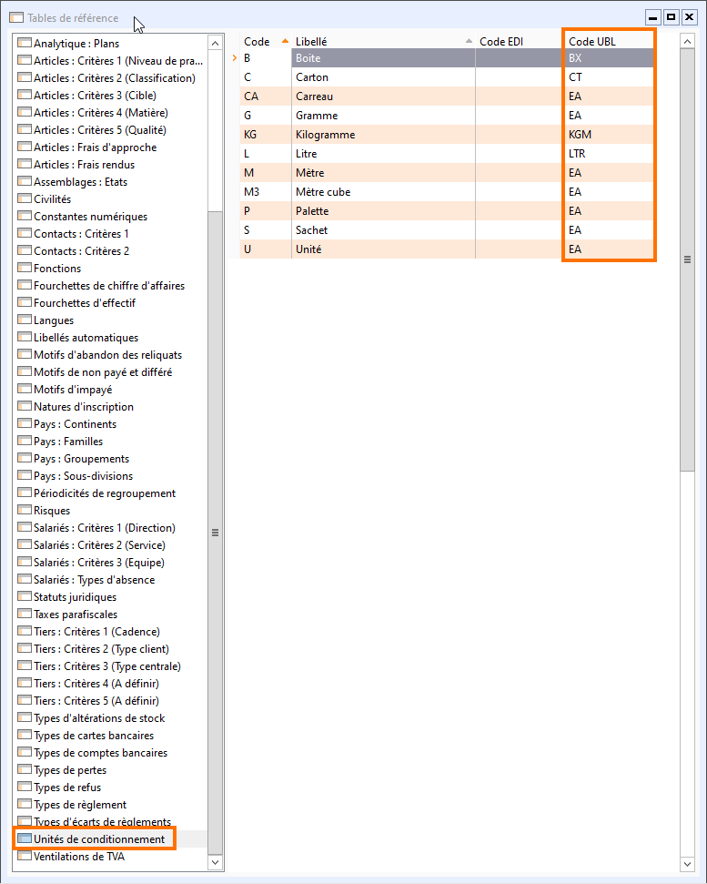

# Paramétrage des unités de conditionnement

Dans le cas où vous utilisez les unités 
 de conditionnement dans les documents au format Chorus, assurez-vous que 
 les Code UBL soient renseignés dans les tables de référence des unités 
 de conditionnement.

 

Elles sont accessibles via le menu Société | Paramétrage | Tables de référence, 
 dans la branche "Unités de conditionnement" :

 

