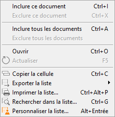

# Export des factures et avoirs clients

## Menu

L'export des factures de ventes au format Chorus se fait depuis le menu 
 Outils | EDI | Exporter des factures clients 
 au format Chorus.

 

## Fenêtre

La fenêtre d'export suivante s'ouvre :

 

 

Vous pouvez alors indiquer :

* Le dossier dans lequel seront créés les fichiers des factures.
* Le ou les clients concernés. Seuls 
 les clients pour lesquels vous aurez coché l’option "Exporter 
 les factures vers la plateforme Chorus" dans l'onglet EDI de 
 la fiche client apparaîtront dans la liste.
* La période pour laquelle vous souhaitez exporter les factures.
* Une option vous permet également d’exporter à nouveau les factures 
 déjà exportées.

 

Après avoir cliqué sur le bouton "Suivant", une fenêtre de 
 sélection des documents à exporter s’ouvre :

 

 

Les lignes qui apparaissent barrées correspondent 
 à des documents comportant des anomalies provoquant un rejet lors de son 
 chargement sur la plateforme ChorusPro. 

En effectuant un double clic sur ces lignes 
 vous obtenez la liste des anomalies constatées.

Il faudra alors retourner dans le document 
 et procéder aux corrections attendues pour en effectuer l'export.

 

 

Les contrôles suivants sont effectués :

* Présence du code pays dans l'adresse de facturation
* Présence du code pays dans l'adresse de livraison
* Présence du N° SIRET dans l'adresse de facturation
* Présence du N° SIRET dans l'adresse de livraison
* Présence d'un n° d'engagement et d'un n° de bon de commande, 
 permettant de s'assurer que seule l'une des 2 occurrences est remplie

 

Il vous est possible d’inclure ou d’exclure des documents de votre sélection 
 en effectuant un double clic sur les lignes souhaitées.

 

Vous pouvez également accéder au menu contextuel via un clic droit sur 
 les lignes concernées :

 

 

Ce menu vous donnera accès à différentes fonctions telles que :

* Inclure ou exclure un document
* Inclure ou exclure tous les documents
* Ouvrir le document

 

Après avoir terminé la sélection des documents à exporter, cliquer sur 
 le bouton "Terminer". Un rapport d’export apparaît à l’écran 
 :

 

 

Les [fichiers générés](../5/StructureGeneraleFichierGenere.md) 
 peuvent ensuite être déposés manuellement dans le portail Chorus Pro.

