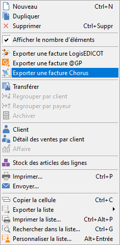
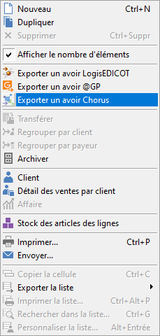
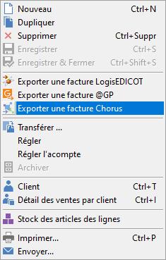
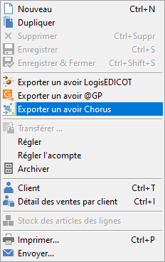
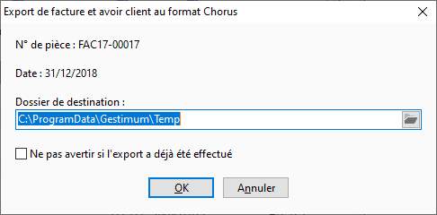
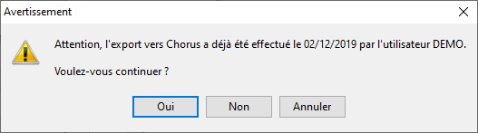

# Export d'une seule facture ou d'un seul avoir client
## Menu

L'export d'une seule facture client ou d'un seul avoir client se fait 
 :

 

- soit par le menu contextuel de la liste des documents de vente

 

 

 

- soit par le menu contextuel d'une facture client ouverte ou d'un avoir 
 client ouvert

 

 

## Fenêtre

 

L'option "Ne pas avertir si l'export a déjà été effectué" 
 permet de désactiver l'affichage du message suivant :

 

