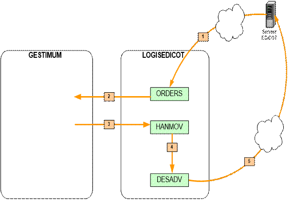

# Présentation

Gestimum ERP propose une solution EDI (Échange de données informatisées) pour permettre l’échange entre différents partenaires (Clients et fournisseurs) par l’intermédiaire des fichiers au format XML (Extensible Markup Language).

 

Elle permet le remplacement des documents papiers par des fichiers informatiques structurés, et offre un gain en temps et fiabilité.

 

L'interface EDICOT facile à utiliser permet les échanges EDI :

- en commençant par l'import des commandes clients (message ORDERS) au format XML

- une fois la date de livraison définie, ainsi que les quantités à livrer, la commande client peut être exportée en confirmation de commande (message ORDRSP)

- après acceptation définitive, les commandes clients importées peuvent être transférées en bon de préparation (un nouvel état disponible pour cette interface EDI) puis exportées vers l'interface EDICOT (message HANMOV)

- l'interface EDICOT complète ensuite les éléments de la livraison : colisage, palettisation, etc et les transfère à Gestimum ERP

- l'import de l'avis d’expédition (message DESADV) dans Gestimum ERP met à jour ces éléments et génère automatiquement le bon de livraison

- la facture peut être générée (message INVOIC)

 

Nous traiterons dans un premier temps [l'import d'ORDERS](../3/ImportORDERS.md), [l'export d'ORDRSP](../4/ExportORDRSP.md), le transfert en bon de préparation, [l'export d'HANMOV](../5/ExportHANMOV.md), [l'import de DESADV](../6/ImportDESADV.md) et [l'export d'INVOIC](../7/ExportINVOIC.md).

 

Ci-dessous, le schéma complet :

 

 

| Gestimum | EDICOT | Description |
| --- | --- | --- |
| ORDERS | ORDERS | Commande |
| ORDRSP | ORDRSP | Accusé de réception de commande |
| HANMOV | HANMOV | Bon de préparation, de livraison |
| DESADV | DESADV | Avis d'expédition |
| INVOIC | INVOIC | Facture |
| PRICAT | PRICAT | Fichiers des articles |
| PARTIN | PARTIN | Fichiers des Partenaires |
|   | IFCSUM | Demande enlèvement aux transporteurs |

