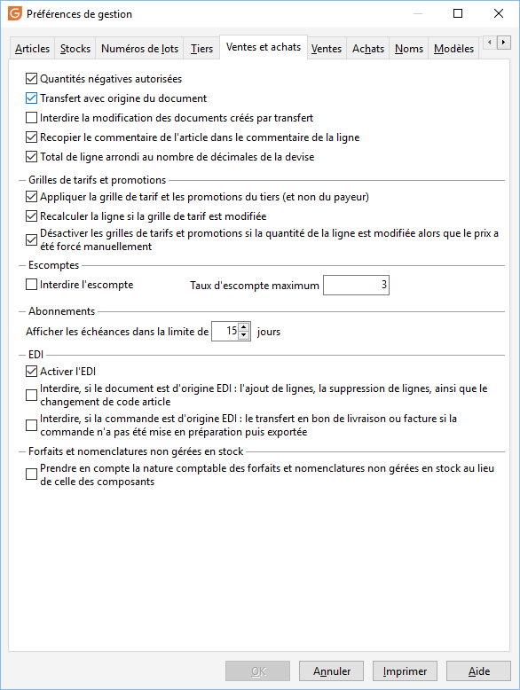

# Paramétrage

La mise en place de cette solution nécessite le paramétrage suivant 
 :

## Préférences de la société

Le code barre dans l’onglet Identification des 
 Préférences de la société

## Clients

Le code barre dans l’onglet "Admin." 
 de la Fiche client des tiers

 

Le code barre dans le sous onglet adresse de 
 livraison de l’onglet général de la Fiche client

## Articles

Le code barre de la fiche article doit 
 être renseigné

 

L’unité de conditionnement de vente de la Fiche 
 article doit être correctement définie et doit être identique à celle 
 transmise dans les fichiers d’import

## Préférences de gestion

Dans "SOCIETE 
 | Paramétrage | Préférences de Gestion | Ventes et Achats", 
 deux options sont décochées par défaut :

 

### Option "Activer l’EDI"

Si cette option est cochée, elle permet :

 

* L’accès 
 au menu Outils /EDI,
* L’accès 
 au menu contextuel lié à l’export ORDRSP et passage en "Bon de 
 Préparation" dans la liste des documents de vente,
* État 
 "Bon de préparation" disponible dans la liste des états 
 des documents de vente,

### Option "Interdire, si le document est d'origine EDI : l'ajout 
 de lignes, la suppression de lignes, ainsi que le changement de code article" 
 accessible si l’option "Activer l’EDI est cochée"

Cette option permet de protéger un document EDI de certaines modifications 
 non souhaitées.

