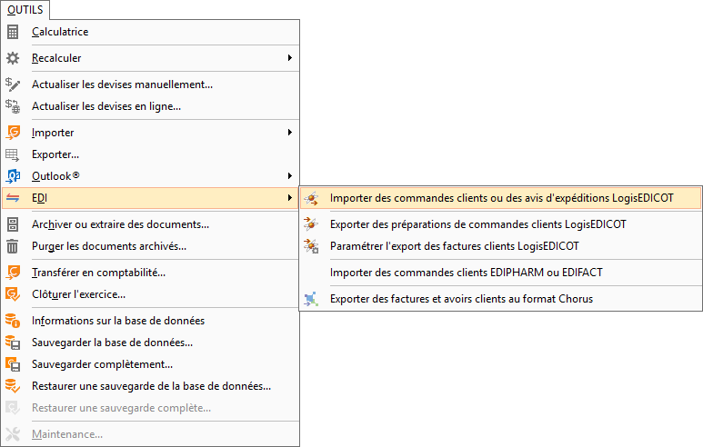
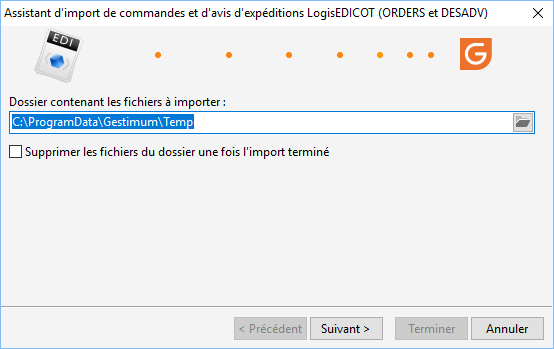
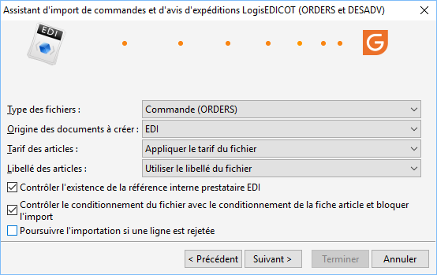

# Import d'ORDERS

## Menu

A partir du menu Outils | EDI | Importer 
 des commandes clients ou des avis d'expéditions LogisEDICOT, il 
 est possible d’importer les accusés de réception (ORDERS) :

 

## Assistant d'import

 

### Dossier contenant les fichiers à importer

Sélectionnez le répertoire contenant le ou les fichiers à importer. 
 Tous les fichiers EDI disponibles dans ce répertoire correspondant au 
 format ORDERS attendu seront pris en compte,

### Supprimer les fichiers du dossier une fois l’import terminé

Pour faciliter à l’utilisateur la gestion des fichiers importés, cette 
 option permettra de les effacer du poste de travail, sachant que l’interface 
 EDICOT possède déjà une copie de ce fichier.

### Types de fichiers

Commande (ORDERS) ou Avis d’expédition (DESADV)

### Origine des documents à créer

Proposera le choix suivant : Rien, Courrier, 
 e-mail, télécopie, téléphone, etc.

Ces données seront reprises dans le champ Origine 
 dans l’onglet "Autre") du document de vente, les codes affichés 
 sont disponibles dans les Tables de références/Documents/Origines

### Tarif des articles

Appliquer le tarif du fichier : lors de l’importation 
 des commandes, le prix de l’article est repris du fichier à importer

Ignorer le tarif du fichier : lors de l’importation 
 des commandes, le tarif du fichier est ignoré et la commande reprendra 
 le tarif de la fiche article

### Libellé des articles

Utiliser le libellé du fichier ou ignorer le 
 libellé du fichier

### Contrôle d’existence de la référence Interne prestataire EDI

Il est possible de bloquer l’import si la référence 
 EDICOT n’est pas présente dans le fichier. Si cette option est cochée, 
 un Orders avec une référence EDICOT déjà importé ne pourra plus être importé

### Contrôler le conditionnement du fichier avec le conditionnement de 
 la fiche article et bloquer l'import

Il est possible de bloquer l'import sur il existe 
 une différence de configuration des conditionnements entre celui stocké 
 dans la fiche article Gestimum et celui du fichier d'import

### Poursuivre l'importation si une ligne est rejetée

Permet d'importer la partie valide des commandes 
 et d'ignorer les erreurs.

## Commandes clients générées

Les données récupérées dans la commande client créée sont les suivantes 
 :

### Entête du document

* Code client (identifié par son code barre)
* Date de la commande
* Date prévue le
* Code barre émetteur (code barre client)
* Code barre SU (code barre de la société)
* N° de document client (Information EDICOT)
* Référence EDI (information EDICOT), champ disponible également 
 dans l’onglet Info du document
* Référence EDICOT (Information EDICOT)
* Référence de contrôle (Information EDICOT)
* Traitement ayant créé le document : "Import EDI"
* Origine : Champ renseigné lors de l’import
* État du document sera initialisé à "En cours"

### Lignes du document

* Code article
* Libellé (de l’article Gestimum ou du fichier XML selon choix lors 
 de l’import)
* Quantité
* Unité
* Unité de base
* Conditionnement vente (LIG\_COND)
* Prix HT unitaire de l’article Gestimum ou du fichier XML selon 
 choix lors de l’import Onglet "Info"
* Référence EDI (Information EDICOT)
* Commentaires : Nom et chemin du fichier importé

 

La devise du document correspondra à la devise du tiers, le dépôt principal 
 sera utilisé par défaut.

## Numéros de lots

Pour contrôler la saisie des N° des lots dans les documents de vente 
 (information indispensable pour le suivi et la traçabilité de l’article), 
 vous pouvez activer l’option : "Stock à terme négatif interdit" 
 dans les Préférences de Gestion/Onglet Stock.

## Circuit EDICOT pour les accusés de réception EDI

Une fois l’accusé de réception importé, le circuit EDICOT à suivre est 
 le suivant, la commande importée (Orders) se retrouve dans les mêmes conditions 
 qu’un accusé de réception classique, seules particularités le traitement 
 ayant créé le document est "Import EDI" et une référence EDI 
 et EDICOT sont renseignées.

 

Vous pouvez :

* Renseigner si 
 nécessaire les N° de lots dans les accusés de réception

* Transférer les 
 accusés de réception en Bon de préparation. Cet état disponible uniquement 
 pour les Accusés de réception (Orders) "EDI" avec une référence 
 EDICOT est accessible à partir de la liste des documents de vente/Transférer

* Exporter les 
 "Bons de préparation" en Hanmov vers l’interface EDICOT 
 à partir du menu Outils/ Solutions Partenaires/ Echange EDI/ Export 
 EDI. Le document restera en type Accusé de réception avec un l’état 
 "Exporté".

 

L’étape suivante dans ce process : l’import de l’avis d’expédition (DESADV) 
 puis la génération automatique du bon de livraison seront disponible dans 
 une version ultérieure.

## Circuit classique pour les commandes EDI

L’utilisateur a la possibilité de générer hors circuit EDICOT un bon 
 de livraison classique :

 

* Transférez l’accusé 
 de réception en "Bon de préparation" puis, exportez-le (menu 
 Outils/EDI/Exporter des préparations de commandes clients LogisEDICOT)

* A partir de la 
 liste des documents de vente du menu contextuel "Transférer", 
 il sera possible de générer un Bon de livraison ou une Facture

