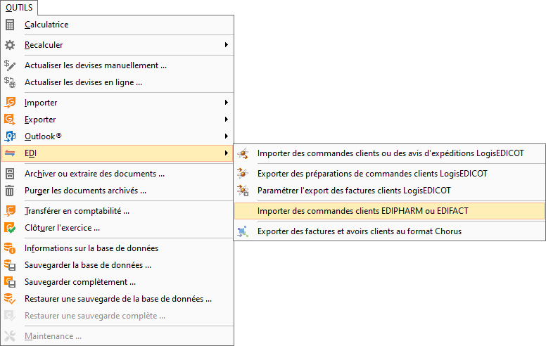
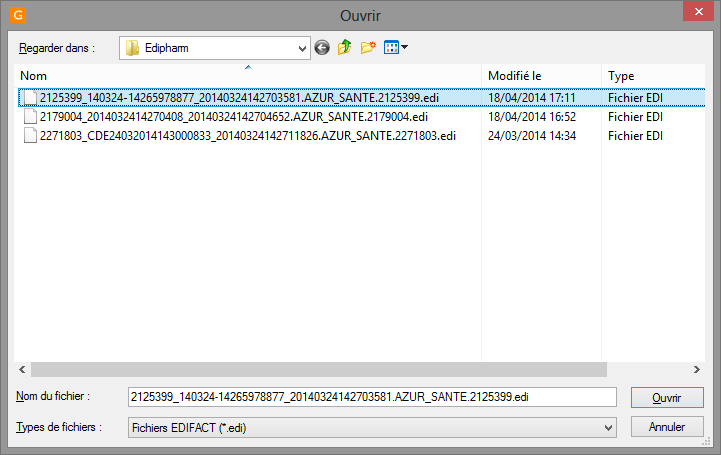
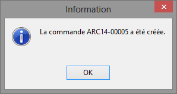
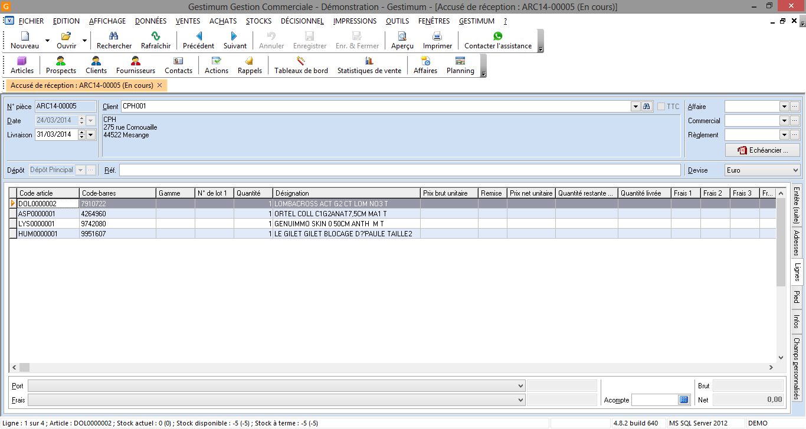

# Import de commandes EDIPHARM
Allez dans le menu Outils| EDI |Importer une commande client EDIFACT :

 

 

Indiquez le répertoire contenant vos commandes et sélectionnez votre fichier de commande, puis cliquez sur "Ouvrir".

 

 

Cela va lancer le traitement de l’importation.

 

 

Cliquez sur « Ok » et vous accéderez à la commande qui vient d’être importée.

 

