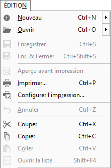
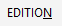

# Menu EDITION

A l'ouverture du Logiciel, ou si aucune société n'est ouverte, tous 
 les sous-menus du menu "Édition" sont grisés, donc non accessibles. 
 

 

Une fois que vous avez créé une nouvelle société ou ouvert une société 
 préexistante, certains sous-menus deviennent accessibles, alors que d'autres 
 ne le sont plus :

 

Les sous-menus : "annuler, couper, copier et coller" servent 
 principalement lors de la saisie ou de la modification des données et 
 ne sont donc accessibles que dans ces circonstances.

 

 

Les sous-menus grisés ne sont pas accessibles à ce stade.

 

Cliquez sur les autres sous-menus pour plus de renseignements les concernant.

### Accès au menu EDITION :

Il existe différentes méthodes pour accéder au menu Édition :

 

* Barre de Menu

 

 

* Raccourci Clavier Alt+E

