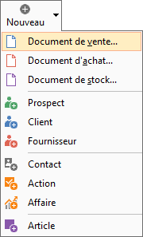
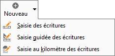
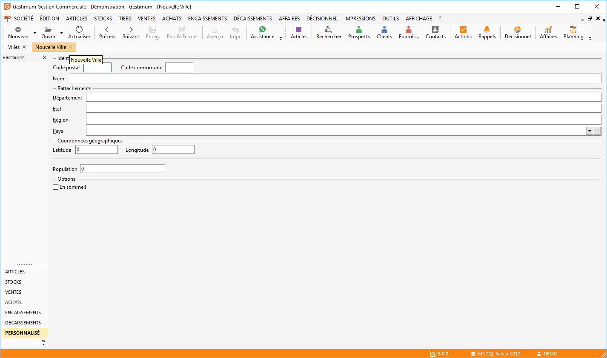

# Nouveau

Ce menu permet différentes opérations, selon son lancement à partir 
 de la gestion ou de la comptabilité, et l'endroit depuis lequel vous accédez 
 à ce menu .

## Aucune fenêtre ouverte

### Gestion Commerciale

Il vous propose par défaut de créer un nouveau document de vente (voir 
 accès). Si vous désirez saisir un autre type de documents : cliquez sur 
 la flèche positionnée à droite du menu SOCIETE / Nouveau ou cliquez sur 
 la flèche positionnée à droite de la boîte nouveau. 

 

 

### Comptabilité

Il vous propose par défaut la fenêtre de la saisie standard (voir accès). 
 Si vous désirez saisir un autre type de documents cliquez sur la flèche 
 positionnée à droite du menu fichier/nouveau ou cliquez sur la flèche 
 positionnée à droite de la boîte nouveau.

## Avec une fenêtre ouverte

Gestimum vous propose une nouvelle fiche. Si vous consultez par exemple 
 la fiche liste des villes et vous sélectionnez nouveau (voir accès), Gestimum 
 vous présente la fiche d’une nouvelle ville.

  

