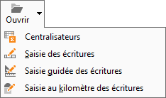

# Ouvrir

Ce menu se présente différemment et permet différentes opérations, selon 
 le type de logiciel utilisé (gestion ou comptabilité) et l'endroit depuis 
 lequel vous accéder à ce menu.

## Aucune fenêtre ouverte

### Gestion commerciale

Gestimum vous propose par défaut la liste des documents de vente. (Voir 
 accès).

 

Si vous désirez afficher un autre type de documents: cliquez sur la 
 flèche positionnée à droite du Menu SOCIETE/Ouvrir.

 

### Comptabilité

Gestimum vous propose par défaut la liste des centralisateurs pour accéder 
 à la saisie standard (Voir accès).

 

Si vous désirez saisir un autre type de documents cliquez sur la flèche 
 positionnée à droite du Menu SOCIETE/Ouvrir.

## Avec une fenêtre ouverte

Gestimum vous permet d’accéder à la liste des éléments de cette fiche.

 

Par exemple : Lorsque vous travaillez sur la fiche de la Ville Fontanges 
 et que vous sélectionnez Ouvrir. Vous obtiendrez alors la liste des villes, 
 avec la Ville Fontanges qui est automatiquement sélectionnée.

## Lorsque vous êtes sur une liste précise et que vous sélectionnez ouvrir,

Gestimum vous permet d’accéder à la fiche sélectionnée dans la liste.

 

Par exemple : Lorsque vous avez sélectionné Fontanges sur la liste des 
 villes,et que vous choisissez ensuite Ouvrir (voir accès ci-dessous), 
 vous obtiendrez la fiche de la Ville Fontanges.

.

