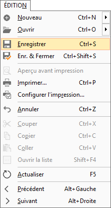
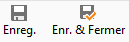

# Enregistrer

L'enregistrement d'une donnée n'est possible que lors de la création 
 ou de la modification d'une donnée. Si tous les critères obligatoires 
 pour une donnée ne sont pas indiqués, l'enregistrement ne se fera pas 
 et générera un message d'alerte.

## Accès au menu Enregistrer

### Menu

### Bouton

### Raccourci clavier

Ctrl + 
 S

