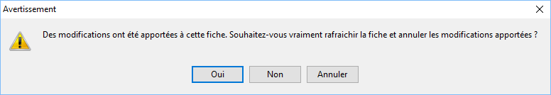

# Actualiser

Actualiser recharge le contenu des 
 [fenêtres](javascript:TextPopup(this)).

 

Attention : Lorsque vous êtes en cours 
 de saisie une nouvelle donnée qui n'a pas été enregistrée, vous risquez 
 de perdre vos informations.

 

Lorsque vous lancez la commande rafraîchir (touche
F5) 
 alors que vous êtes en cours de saisie, Gestimum vous prévient des dangers 
 grâce à l'avertissement ci-dessous :

 

