# Décaissements de A à Z

## Virement

Vous créez une facture d’achat avec une échéance 
 et un mode de règlement de type "Virement".

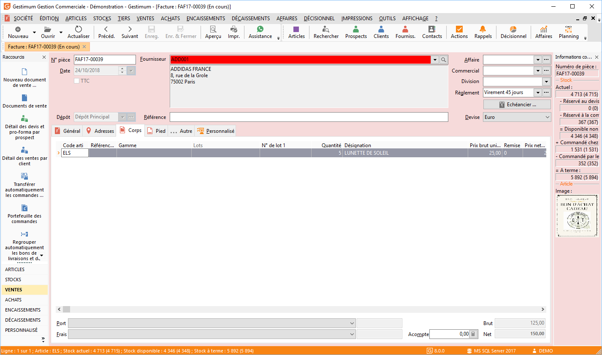 

 

Allez dans "Décaissements/Échéances fournisseurs".

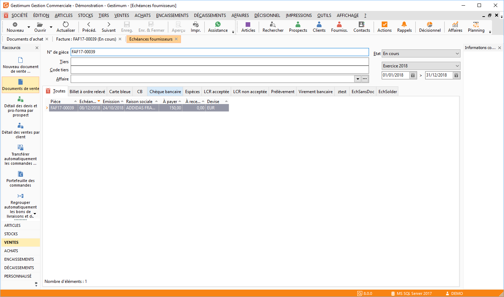
Il existe 3 méthodes pour faire votre émission de paiement

### 1ere méthode

Recherchez votre facture d’achat (soit par nom 
 du tiers ou par N° de pièce par exemple) puis dessus faites clic droit 
 "Payer l’échéance"

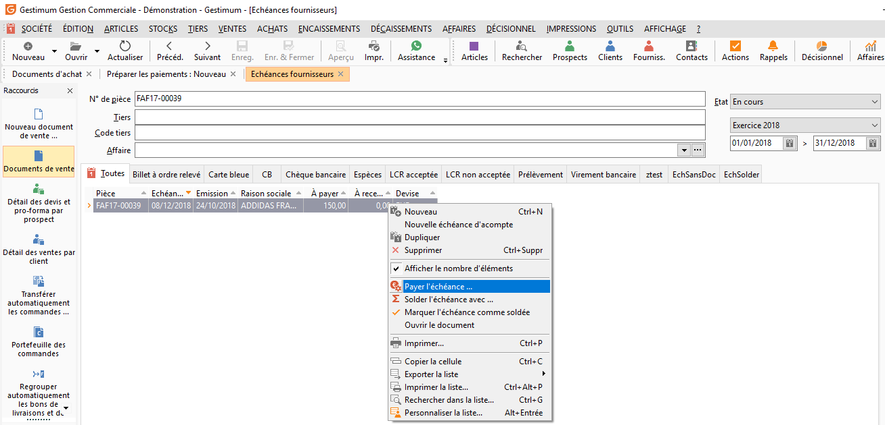
 

La fenêtre qui s’ouvre vous propose de préparer 
 les paiements et de faire l’émission de paiement en même temps (en cochant 
 la case "Émettre le paiement")

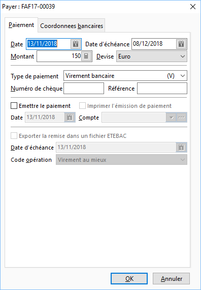
 

Ensuite cliquez sur "OK" et vous avez 
 la possibilité d’imprimer cette émission de paiement

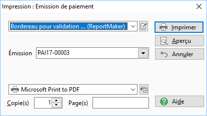
 

Votre facture est maintenant "soldée"

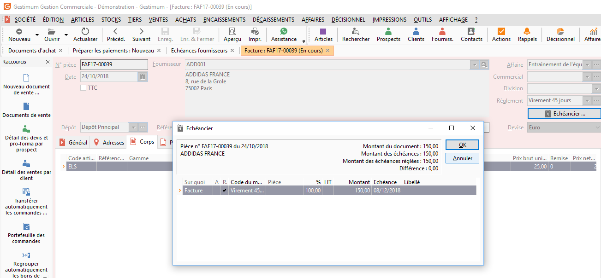
### 2ème méthode

Si vous avez plusieurs factures d’achat (du 
 même fournisseur) à payer en même temps vous pouvez sélectionner vos factures 
 (en faisant la touche shift + la flèche du bas de votre clavier, pour 
 faire votre sélection non concomitante faites control + clic) afin de 
 faire votre "Émission de paiement".

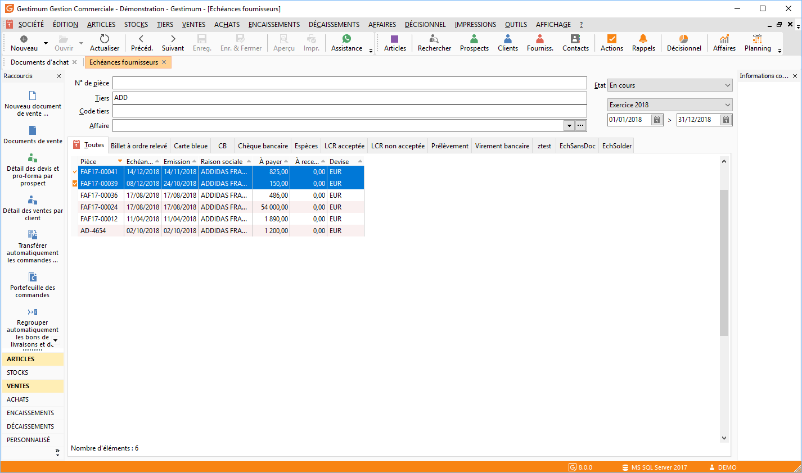
 

Une fois la sélection effectuée, faites clic 
 droit "payer les échéances" et suivez les étapes expliquées 
 précédemment pour emmètre le paiement

### 3éme méthode

Allez dans "Décaissement/Préparer les paiements".

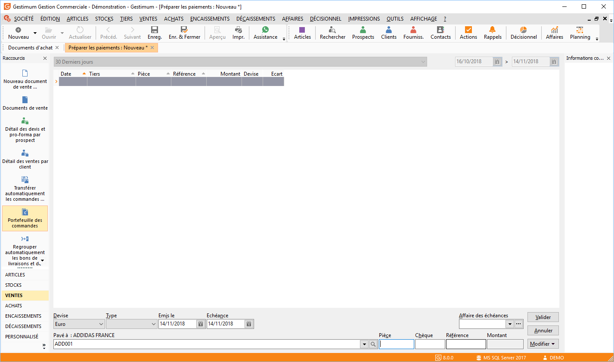
 

En bas de la fenêtre vous pouvez soit : sélectionnez 
 votre fournisseur, votre type de paiement puis cliquez sur "Modifier" 
 et choisissez "Échéances" puis saisissez votre numéro de "pièce" 
 qui sélectionnera les informations directement.

 

Sur cette nouvelle fenêtre sélectionnez les 
 factures que vous souhaitez payer en double cliquant dessus puis cliquez 
 sur "OK"

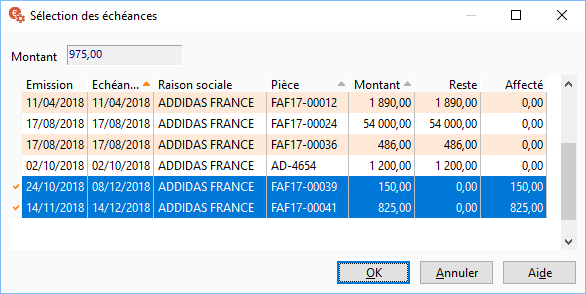
 

Cliquez ensuite sur "Valider" en bas 
 à droite.

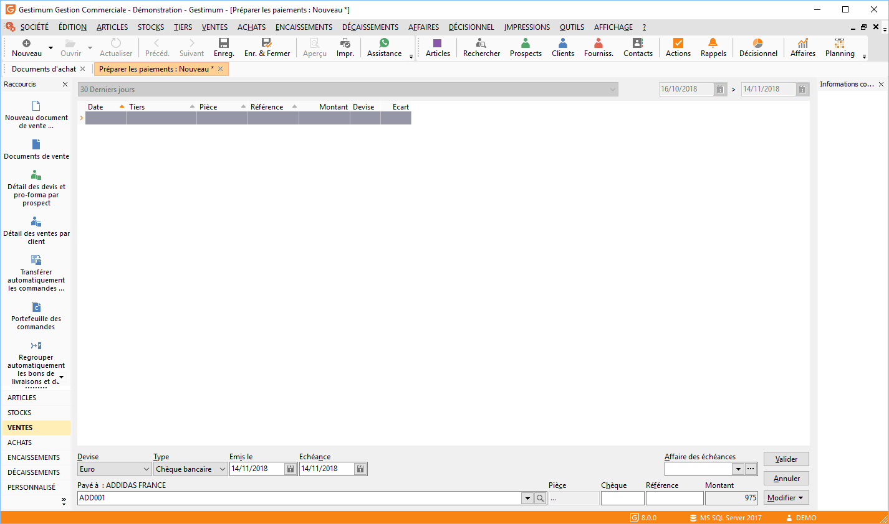
 

Votre préparation de paiement est effectuée.

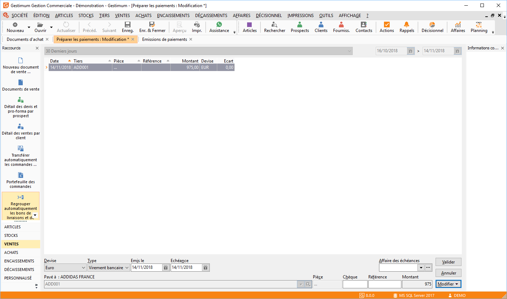
 

Une fois la préparation de paiement effectuée 
 allez dans "Décaissements/Émissions de paiements".

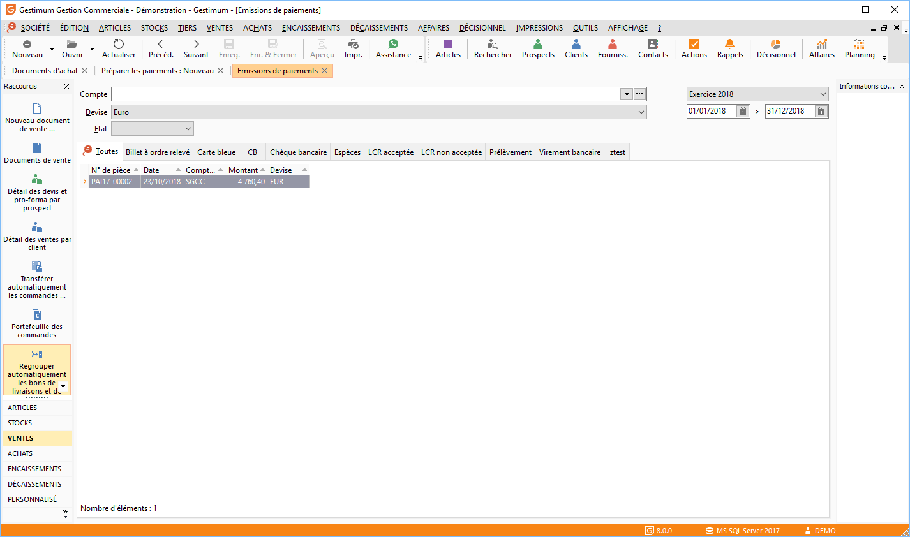
 

Faites clic droit "Nouveau".

 

Sélectionnez impérativement votre "Compte" 
 et votre "type de règlement" afin qu’apparaisse votre paiement. 
 Double cliquez sur votre paiement afin que la coche dans "Émettre" 
 apparaisse. Enfin cliquez sur "Enregistrer".

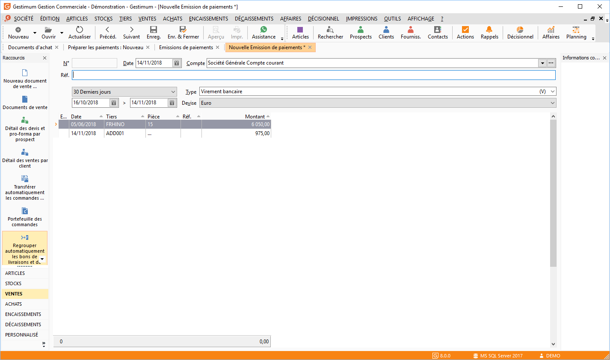
 

Votre émission de paiement est faite.

 

Une fois que vous avez effectué une des méthodes : Retournez dans "Décaissement/Émissions 
 de paiements"

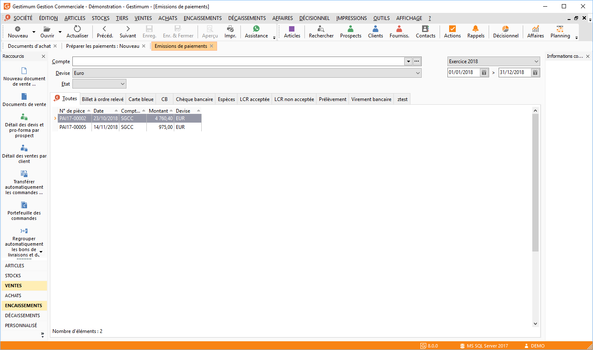
 

Sélectionnez votre "Émission de paiement" 
 soit par "période" soit par "compte" par exemple puis 
 faites clic droit dessus pour sélectionner votre type d’export :

* Exporter dans un 
 fichier au format ETEBAC
* Exporter dans un 
 fichier au format SEPA
* Exporter dans un 
 fichier au format Virement international

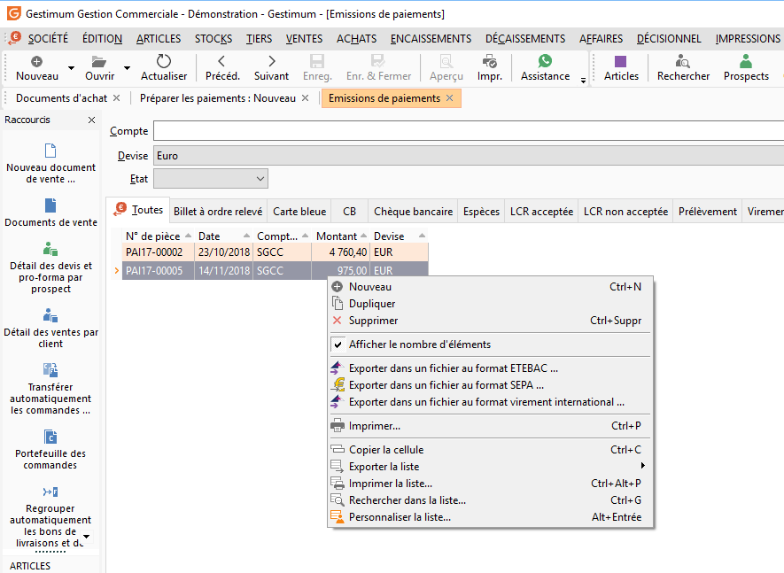
 

Pour le format ETEBAC 
 et SEPA renseignez le "Numéro 
 de client" fourni par votre organisme bancaire dans la sus partie 
 Transferts internationaux de l’onglet "Transmission bancaire" 
 de la fiche banque dans le menu "Société/Comptabilités/Comptes bancaires" 
 pour la Gestion Commerciale et dans le menu "Société/Comptes bancaires" 
 pour la Comptabilité.

 

Pour le format ETEBAC et SEPA il faut paramétrer l’onglet 
 "Banque" de la fiche fournisseur via le menu "Tiers/Fournisseurs".

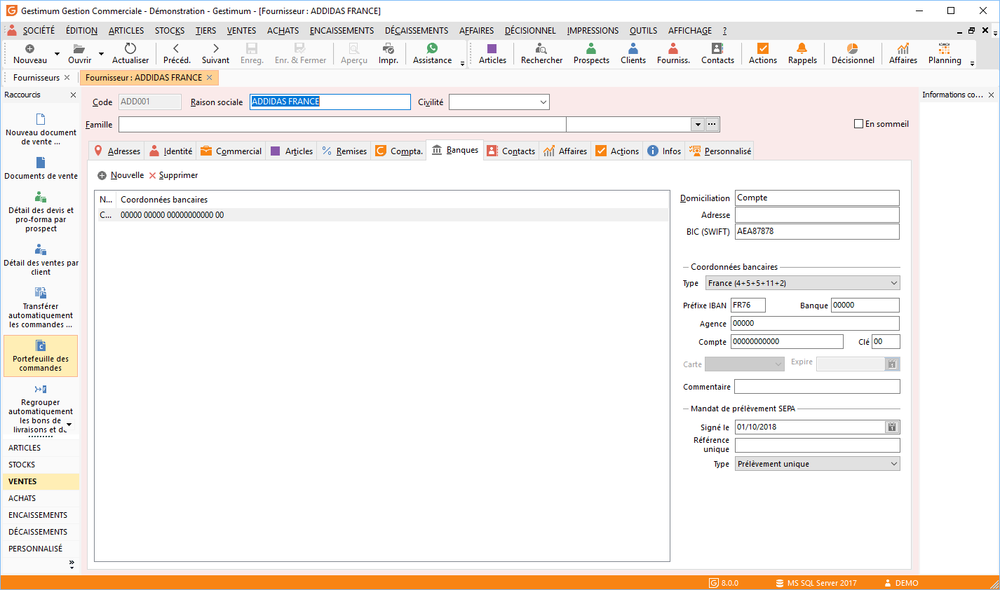
 

Puis une fois le paramétrage effectué vous pourrez enregistrer votre 
 fichier au format ETEBAC ou SEPA et vous pourrez l’envoyer à 
 votre banque.

 

Pour le format "Virement International" 
 (Hors UE) renseignez le "Numéro de client" fourni par votre 
 organisme bancaire dans la sous partie Transferts internationaux de l’onglet 
 "Transmission bancaire" de la fiche banque dans le menu "Société/Comptabilités/Comptes 
 bancaires" pour la Gestion Commerciale et dans le menu "Société/Comptes 
 bancaires" pour la Comptabilité.

 

L’option "Passer à la ligne" à la fin de chaque enregistrement 
 doit être cochée si le fichier à générer doit avoir une longueur limitée 
 par enregistrement (320 pour le format CFNOB).

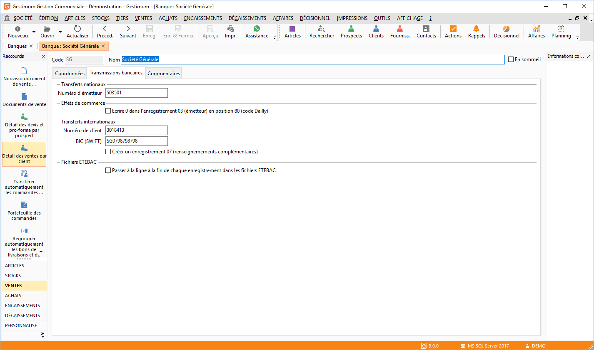
 

Une fois le paramétrage effectué cliquez sur 
 " Exporter votre fichier au format Virement international".

 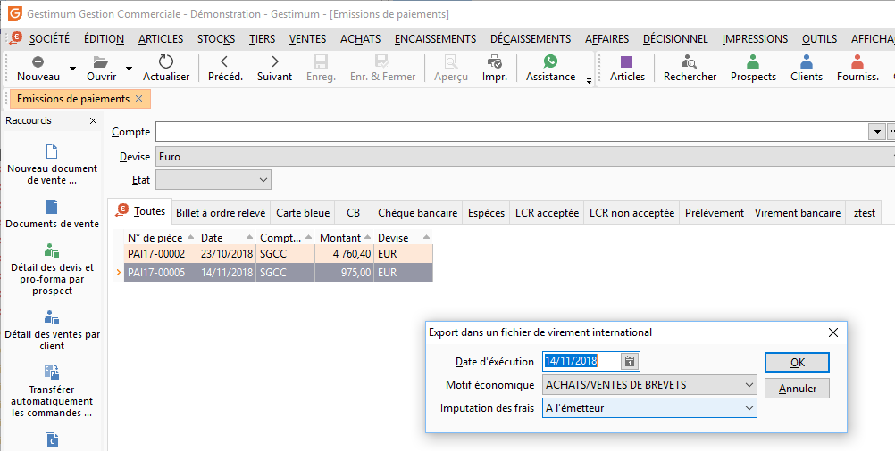
 

Renseignez la "Date d’exécution", 
 le code "Motif économique" puis, "Imputation des frais": 
 bénéficiaire, émetteur, émetteur et bénéficiaire "et enfin cliquez 
 sur "OK".

## Billet à ordre

Le "Billet à ordre" (BOR) est un document qui présente les 
 caractéristiques :

* D'une lettre de 
 change (par la promesse de payer à une échéance donnée),
* Et d'un chèque 
 (par le fait que ce soit le souscripteur qui s'engage à payer, qui 
 émet le billet et le remet au bénéficiaire),
* Dans le dispositif 
 du billet à ordre, les émetteurs et les bénéficiaires sont inversés 
 par rapport à la lettre de change,
* La différence avec 
 un chèque, c'est que la somme due est envoyée seulement à une échéance 
 convenue par les deux parties et connue d'elles deux.

 

Créez une facture d’achat avec une échéance et un mode de règlement 
 de type "Billet à ordre".

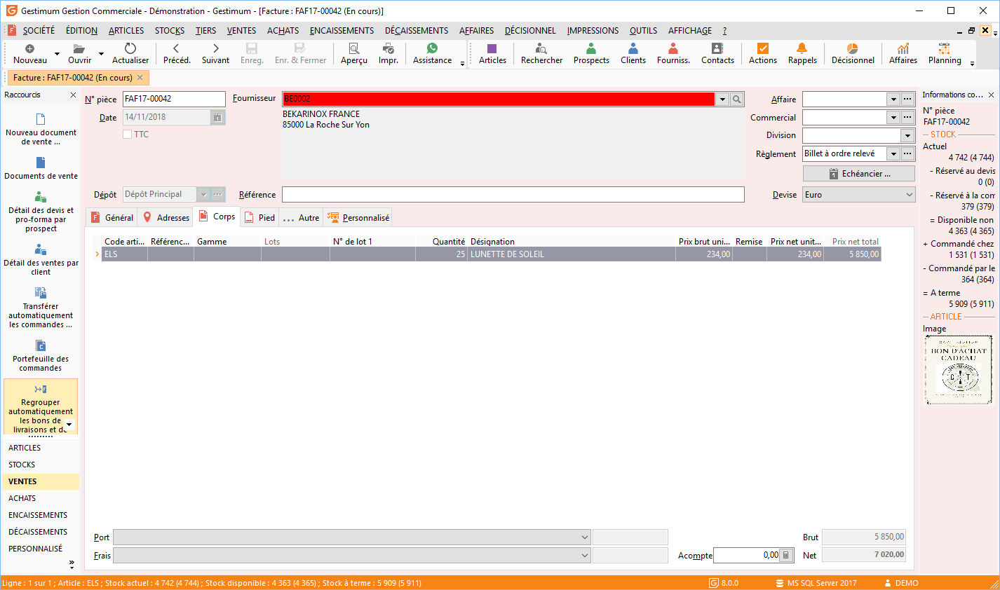
 

Allez dans "Décaissements/Échéances fournisseurs".

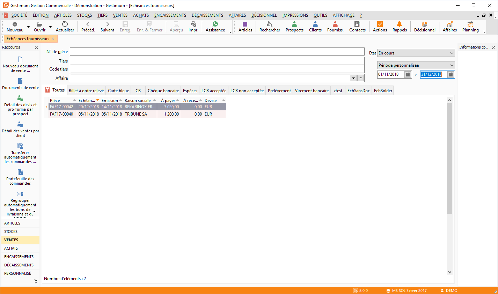
 

Sélectionnez vos factures et faites clic droit 
 "Payer l’échéance".

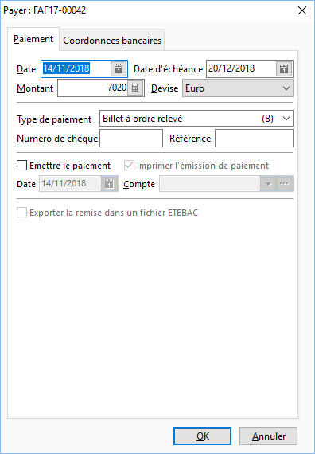
 

Cochez les cases "Émettre le paiement" 
 et "Imprimer l’émission de paiement".

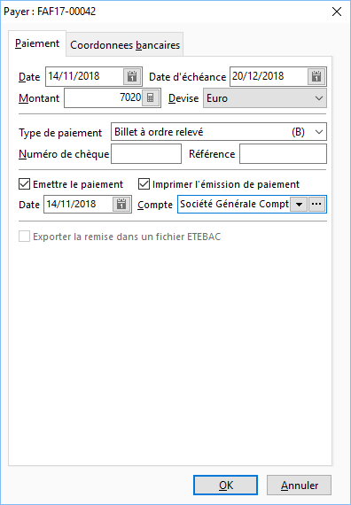
 

Cliquez sur "Imprimer"

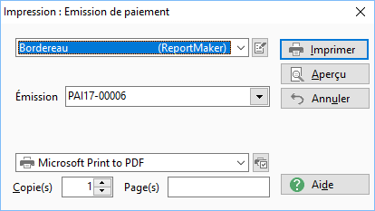
 

A l’impression vous aurez le "Bordereau 
 d’émission de paiement".

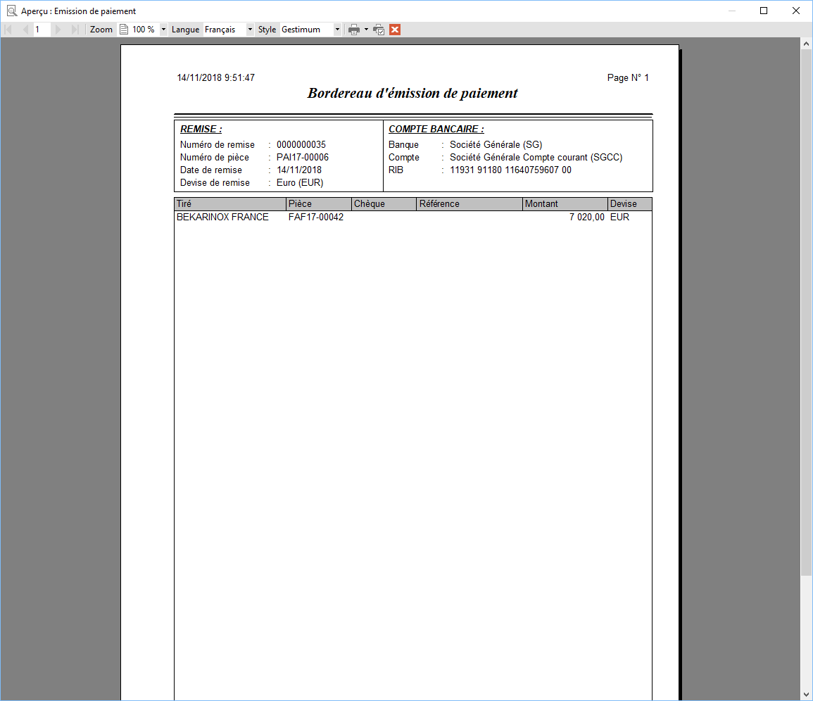
## LCR

Une lettre de change relevé (LCR) est un effet 
 de commerce (papier ou dématérialisé) qui lie un client à son fournisseur. 
 Elle est généralement émise en même temps que la facture. Via une lettre 
 de change relevé, un fournisseur (le tireur) donne l’ordre à son client 
 (le tiré) de lui payer un montant déterminé, à une date déterminée.

 

Sur Gestimum ERP l’utilisation est le même que 
 pour le billet à ordre sauf que dans une facture vous choisissez le mode 
 de règlement "LCR".

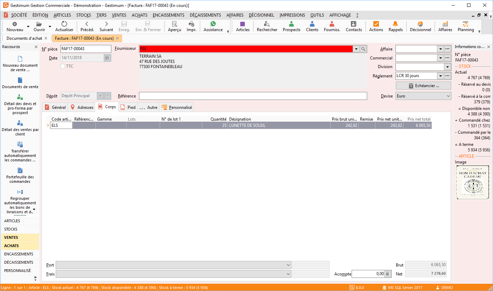
